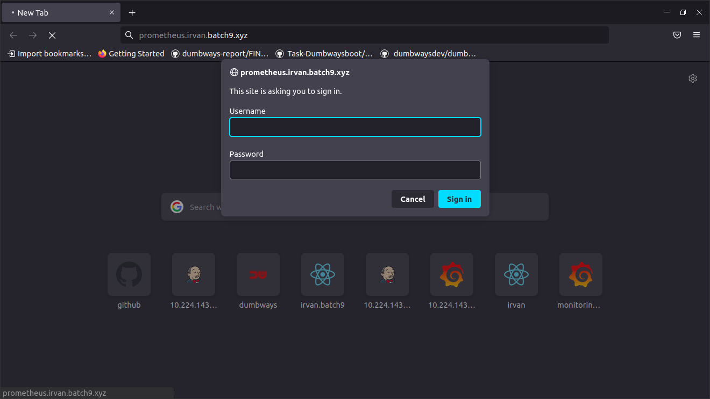
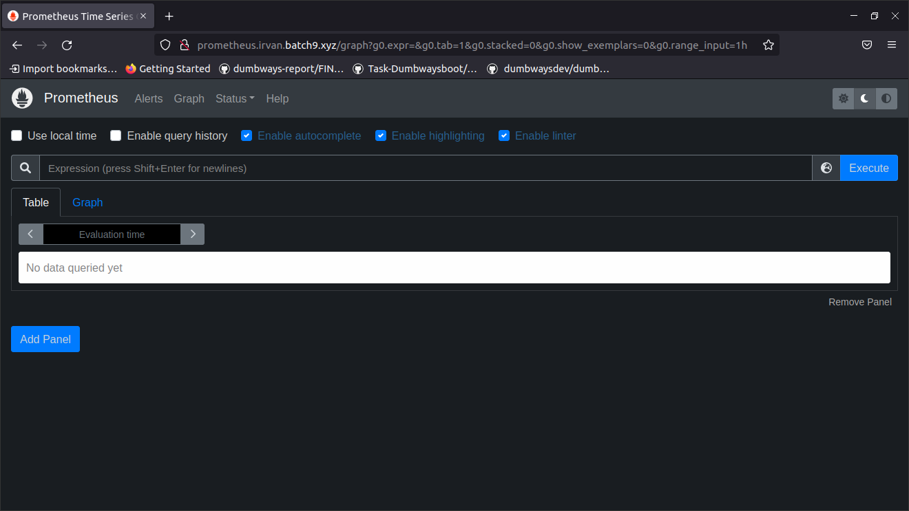

## Auth Prometheus

- Install apache2 utils : `sudo apt install apache2-utils`
- Generate htpasswd : `sudo htpasswd -c /etc/nginx/.htpasswd username`
- copy file /etc/nginx/.htpasswd ke dalam direktori docker nginx
- Buat configurasi Reverse proxy dan Auth

prometheus.conf
```
server {
        listen 80;
        server_name prometheus.irvan.batch9.xyz;

        location /{
        auth_basic "prometheus";
        auth_basic_user_file /etc/nginx/.htpasswd;

        proxy_pass http://10.224.143.66:9090;
        }
}
```

- Akses Prometheus menggunakan beb browser, maka kita harus memasukkan username dan password untuk masuk.

<p align="center"></p>

<p align="center"></p>
