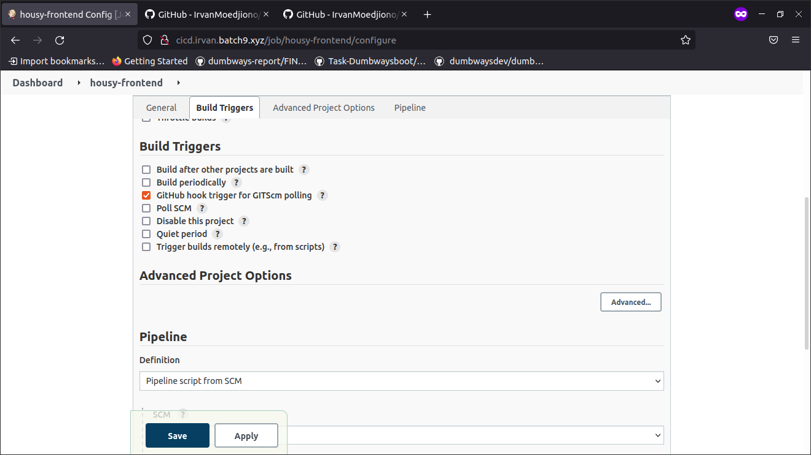

## Installasi Jenkins

- Buat file ansible playbook untuk deploy jenkins

setup-jenkins.yml
```
- hosts: jenkins
  become: true
  tasks:
    - name: Install jenkins on top of docker
      shell: docker run -d --name jen -p 8080:8080 -p 50000:50000 -v jenkins_data:/var/jenkins_home jenkins/jenkins:lts
```

- Lakukan install suggested plugin dan konfigurasi seperti biasa sampai masuk dashboard jenkins

## Automation deploy menggunakan Jenkins pipeline

- Buat Credential baru seperti gambar dan masukkan private key server jenkins

<p align="center"></p>
<p align="center"></p>
<p align="center"></p>

- Buat 2 Jenkins Job pipeline untuk repositori housy frontend dan backend

<p align="center"></p>

- Checklist bagian seperti pada gambar agar dapat menjalankan github webhook

<p align="center"></p>

- Pilih SCM Fit
- Masukkan Repository aplikasi
- pilih Credentials yang sudah dibuat dengan ID server
- Masukkan Branch yang ingin kita deploy
- Klik Apply dan Save

<p align="center"></p>

- Klik Build now pada Jenkins Job housy frontend dan backend

<p align="center"></p>
<p align="center"></p>
<p align="center"></p>

## Webhook

Webhook adalah suatu sistem yang ketika ada perubahan pada repositori github maka url https yang dituju akan tertrigger/berjalan otomatis melakukan deploy. Pada bagian ini karena saya tidak memiliki public host maka saya menggunakan ngrok tunnel agar dapat mengenerate https.

- Install ngrok pada server ci/cd jenkins

`snap install ngrok`

- Connect akun ngrok menggunakan token

`ngrok config add-authtoken 26uCNXCqVRZyS6P2P77A9cQD2rE_33McENVsXnsbNV19KAeGb`

- generate https jenkins 8080

`ngrok http 8080`

<p align="center"></p>

- login jenkins menggunakan alamat https yang sudah dibuat
- Buka repositori github. pilih menu setting lalu webhook.
- pilih add webhook
- masukkan url https kedalam `Payload URL` dan tambahkan `/github-webhook/`

<p align="center"></p>

- Webhook berhasil diterapkan

<p align="center"></p>

- Jenkins Job otomatis akan Ter-trigger ketika ada perubahan pada repository github

<p align="center"></p>
