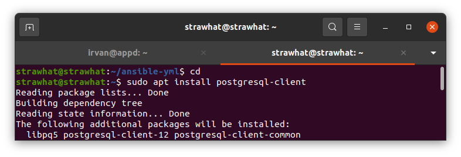
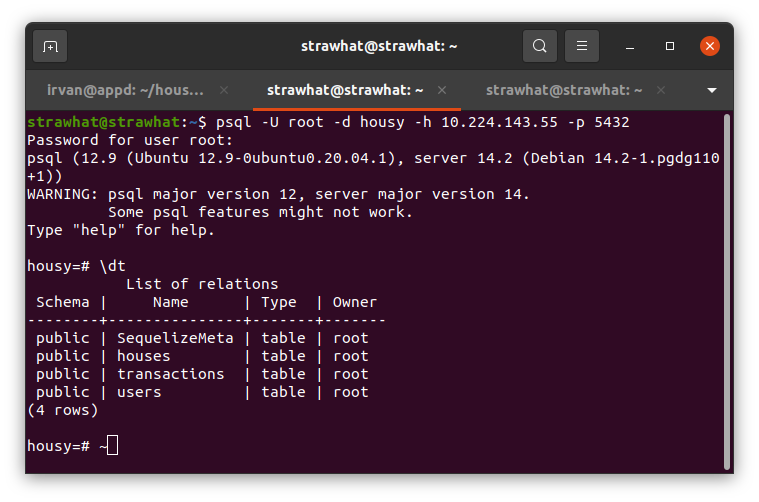

## Deploy database postgresql

- Buat file docker-compose-database.yml

```
version: '3'
services:
  postgresql:
    image: postgres:latest
    container_name: db
    environment:
      POSTGRES_USER: root
      POSTGRES_PASSWORD: root
      POSTGRES_DB: housy
    ports:
      - 5432:5432
    volumes:
      - /home/irvan/postgresql:/var/lib/postgresql/data/
```

- Buat file ansible playbook untuk deploy database

setup-database.yml
```
- hosts: appd
  become: true
  tasks:
    - name: Copying docker compose file
      copy:
        src: docker-compose-database.yml
        dest: /home/irvan/docker-files/

    - name: Run docker compose
      shell: docker-compose -f docker-files/docker-compose-database.yml up -d
```

## Remote database postgresql menggunakan lokal komputer

- Install postgre client : `sudo apt install postgresql-client`

<p align="center"></p>

- ketik perintah 
```
psql -U username -d nama-database -h ip-server -p 5432
```

<p align="center"></p>
