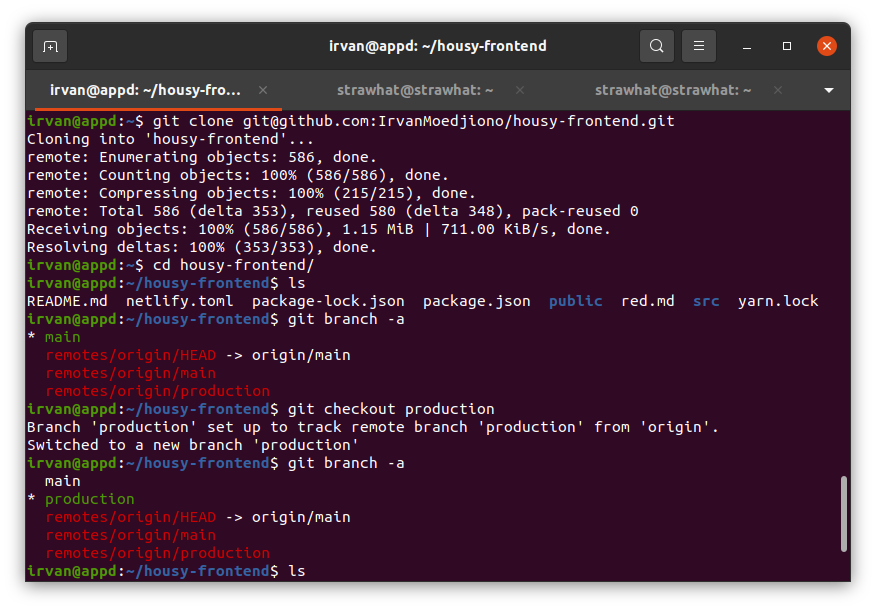
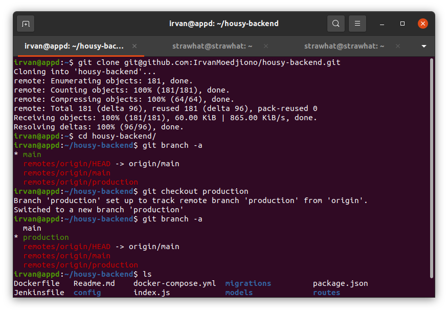
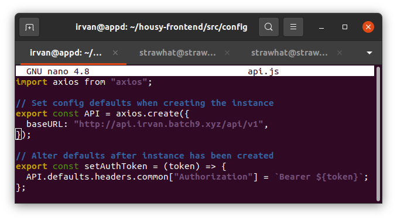
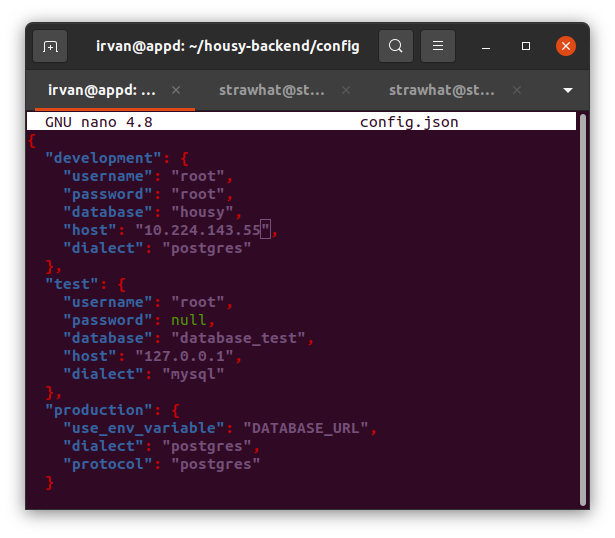

## Setup Reository

- Clone aplikasi housy frontend `git clone git@github.com:IrvanMoedjiono/housy-frontend.git`

- Clone aplikasi housy backend `git clone git@github.com:IrvanMoedjiono/housy-backend.git`

- Ubah baseURL file housy-frontend/src/config/api.js agar terkoneksi aplikasi backend

- Ubah pada bagian production variabel DATABASE_URL, dialect dan protocol ganti postgres agar dapat terkoneksi env production database postgresql

