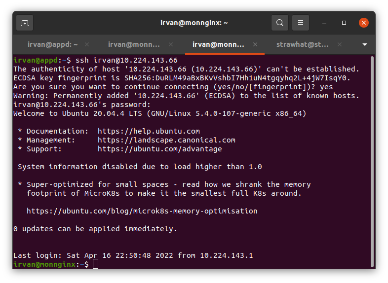
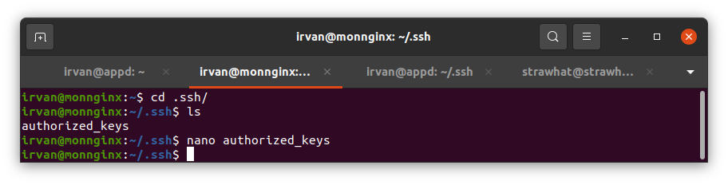
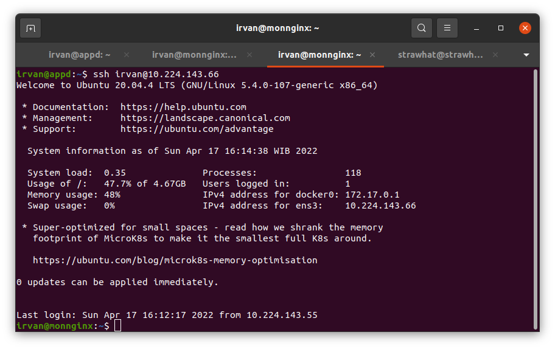
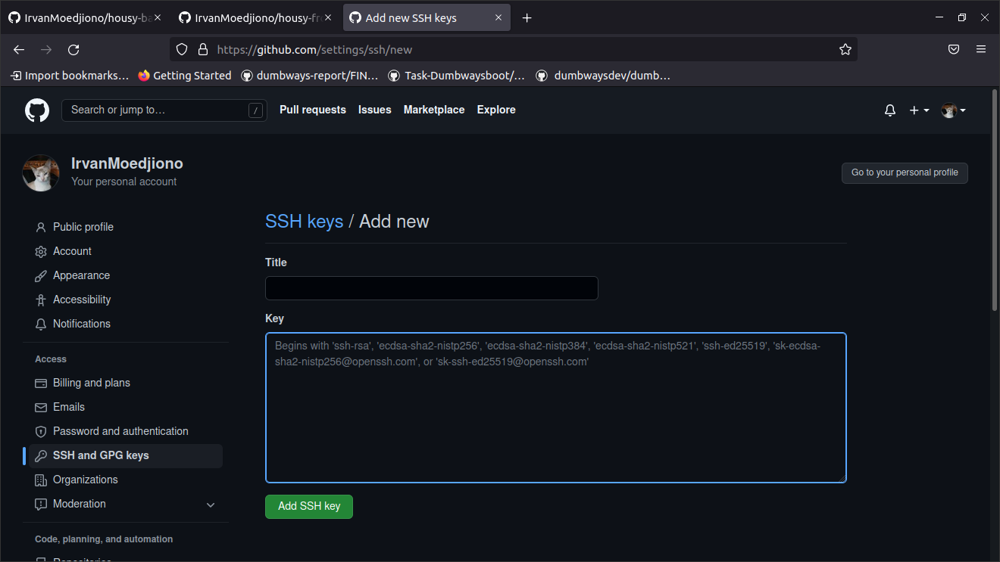
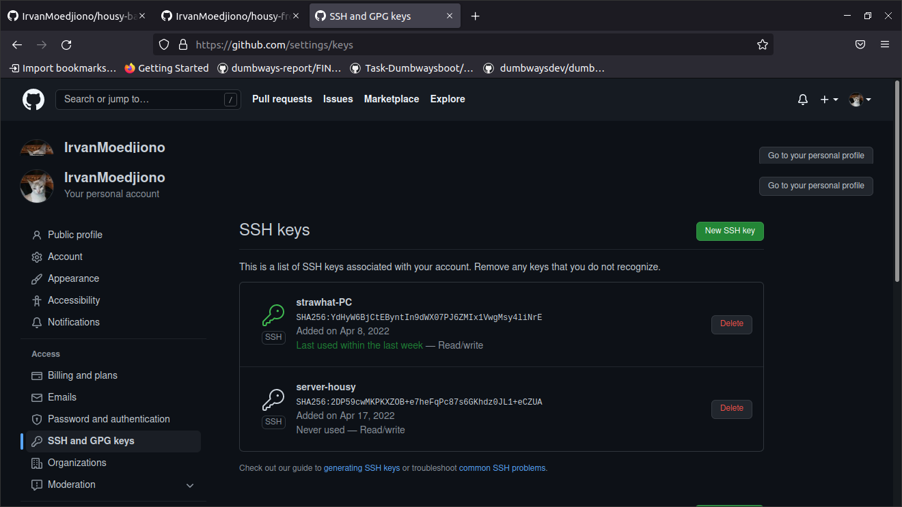
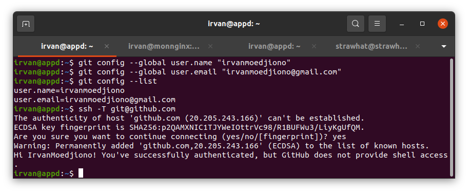

## Remote server menggunakan password

- Ketik perintah `ssh username@ip-server`
- masukkan password

<p align="center"></p>

## Remote server menggunakan public key

- Generate ssh dengan perinta `ssh-keygen`
- Masuk direktori .ssh lalu copy isi dari file id_rsa.pub ke dalam file authorized_key server yang ingin kita remote

<p align="center"></p>

- Ketik perintah `ssh username@ip-server` maka server dapat diremote tanpa harus menggunakan password

<p align="center"></p>

## Menghubungkan server dengan Github

- Masuk menu setting kemudian pilih ssh and gpg key dan tambahkan ssh baru

<p align="center"></p>

<p align="center"></p>

- Inisialisasi username dan email server dengan github

```
git config --global user.name "username-github"
git congig --global user.email "email-github"
git config --list
```

- Cek koneksi antara server dan github `ssh -T git@github.com`

<p align="center"></p>
