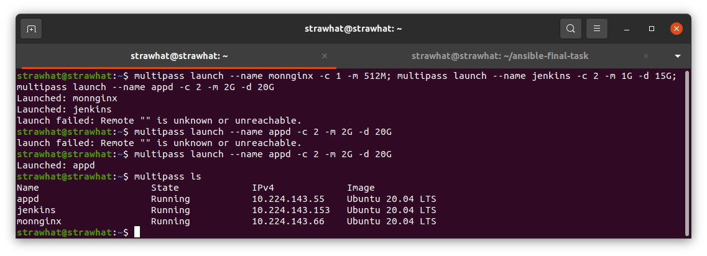
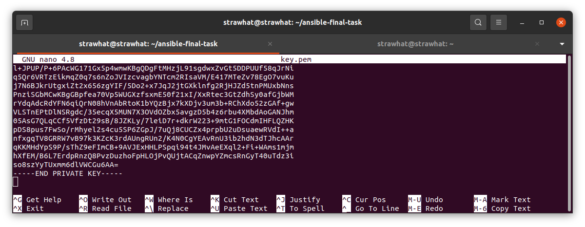

## Setup Server

- Buat 3 server untuk app, database, jenkins, monitoring dan webserver

appd     : 2 CPU, 2G RAM, disk 20GB

jenkins  : 2 CPU, 1G RAM, disk 15GB

monnginx : 1 CPU, 512MB RAM, disk 10G

<p align="center"></p>

- copy private key multipass dan buat file ansible key.pem

lokasi private key : `sudo cat /var/snap/multipass/common/data/multipassd/ssh-keys/id_rsa`

<p align="center"></p>

- Buat file Inventory ansible

Inventory
```
[appd]
10.224.143.55 ansible_user=irvan
[jenkins]
10.224.143.153 ansible_user=irvan
[monnginx]
10.224.143.66 ansible_user=irvan
```

- Buat file ansible.cfg

ansible.cfg
```
[defaults]
inventory = Inventory
private_key_file = key.pem
host_key_checking = false
```

- Install Docker & Docker Compose pada semua server menggunakan Ansible

docker-install.yml
```
- name: Setup Docker & Docker Compose
  hosts: all
  become: true
  tasks:
    - name: setup repository
      shell: sudo apt-get install ca-certificates curl gnupg lsb-release

    - name: Add docker GPG key
      apt_key:
        url: https://download.docker.com/linux/ubuntu/gpg
        state: present

    - name: Add docker repository
      apt_repository:
        repo: deb https://download.docker.com/linux/ubuntu focal stable
        state: present

    - name: update system
      apt:
        update_cache: yes

    - name: install docker engine
      apt:
        name: "{{item}}"
        state: latest
        update_cache: yes
      loop:
        - docker-ce
        - docker-ce-cli
        - containerd.io
        
    - name: usermod docker
      shell: sudo usermod -aG docker irvan

    - name: install docker compose
      shell: sudo curl -L "https://github.com/docker/compose/releases/download/1.29.2/docker-compose-$(uname -s)-$(uname -m)" -o /usr/local/bin/docker-compose

    - name: apply executable permission to the binary
      shell: sudo chmod +x /usr/local/bin/docker-compose
```

- Jalankan Ansible untuk install docker : `ansible-playbook docker-install.yml`
