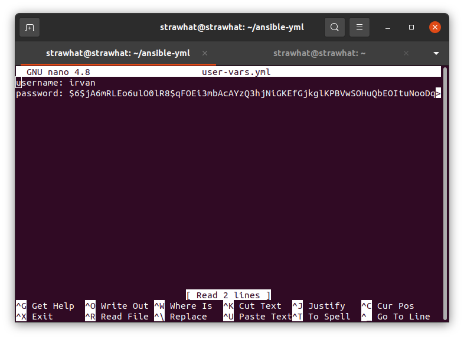

## Create User pada semua server menggunakan Ansible

- Buat encrypt password menggunakan mkpasswd dengan cara install `sudo apt install whois` kemudian `mkpasswd --method=sha-512 password-yang-diinginkan` lalu copy password-nya

- Buat file variabel username dan password, paste mkpasswd kedalam variabel password

user-var.yml
```
username: irvan
password: $6$jA6mRLEo6ulO0lR8$qFOEi3mbAcAYzQ3hjNiGKEfGjkglKPBVwSOHuQbEOItuNooDqqLgyFhNQzuDFRmZmS9TtWZvK1eo1tfRqhjKH1
```

<p align="center"></p>

- Buat file ansible playbook untuk create new user

setup-user.yml
```
- hosts: all
  become: true
  vars_files:
    - user-vars.yml
  tasks:

    - name: update and upgrade system
      shell: sudo apt update; sudo apt upgrade -y

    - name: create new user
      user:
        name: "{{username}}"
        password: "{{password}}"
        groups: sudo
        state: present
        shell: /bin/bash
        system: no
        createhome: yes
        home: /home/irvan

    - name: add pubkey to authorized_keys
      ansible.posix.authorized_key:
        user: "{{ username }}"
        state: present
        key: "{{ lookup('file', '/home/strawhat/.ssh/id_rsa.pub') }}"  
  
    - name: Add user to sudoers file
      ansible.builtin.lineinfile:
        path: /etc/sudoers
        regexp: '^irvanas'
        line: 'irvan ALL=(ALL) NOPASSWD: ALL'
        validate: 'visudo -cf %s'
  
    - name: enable Password Authentication
      lineinfile:
        path: /etc/ssh/sshd_config
        search_string: 'PasswordAuthentication no'
        line: PasswordAuthentication yes

    - name: restart SSH Service
      service:
        name: ssh
        state: restarted
```

- Jalankan `ansible-playbook setup-user.yml`
