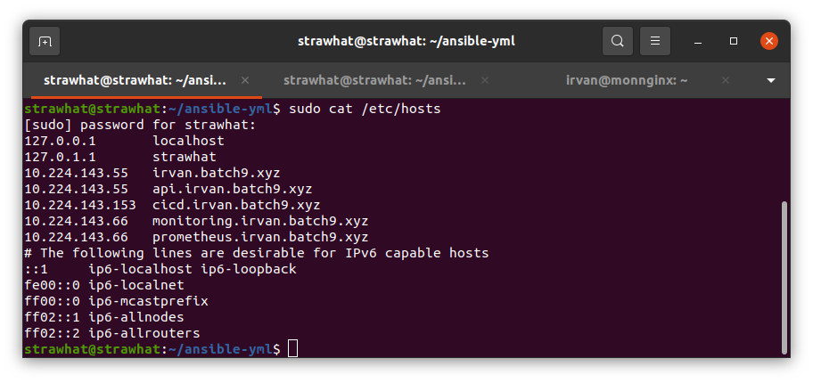

## Webserver Nginx

- Buat file reverse proxy beserta load balance applikasi

frontend.conf
```
upstream app-fro{
	server 10.224.143.55:3001;
	server 10.224.143.55:3002;
}

server {
	listen 80;
	server_name irvan.batch9.xyz;

	location /{
	proxy_pass http://app-fro;
	}
}

```

backend.conf
```
upstream app-bac{
        server 10.224.143.55:5001;
        server 10.224.143.55:5002;
}

server {
        listen 80;
        server_name api.irvan.batch9.xyz;

        location /{
        proxy_pass http://app-bac;
        }
}
```

cicd.conf
```
server {
	listen 80;
	server_name cicd.irvan.batch9.xyz;

	location /{
	proxy_pass http://10.224.143.153:8080;
	}
}
```

monitoring.conf
```
server {
	listen 80;
	server_name monitoring.irvan.batch9.xyz;

	location /{
	proxy_pass http://10.224.143.66:3000;
	}
}
```
- Buat Dockerfile untuk copy semua file reverse proxy ke dalam docker

```
FROM nginx:latest
COPY monitoring.conf /etc/nginx/conf.d/
COPY prometheus.conf /etc/nginx/conf.d/
COPY cicd.conf /etc/nginx/conf.d/
COPY frontend.conf /etc/nginx/conf.d/
COPY backend.conf /etc/nginx/conf.d/
COPY .htpasswd /etc/nginx/
```

- Buat file docker compose untuk build image dan deploy

docker-compose-nginx.yml
```
version: '3'
services:
 Nginx:
   container_name: nginx
   image: nginx:ft
   build: .
   ports:
     - 80:80
```

- Buat file ansible playbook untuk deploy nginx

setup-nginx.yml
```
- hosts: monnginx
  become: true
  tasks:
    - name: Copying nginx folder
      copy:
        src: nginx/
        dest: /home/irvan/nginx/

    - name: Run compose build
      shell:
        cmd: docker-compose -f nginx/docker-compose-nginx.yml build

    - name: run compose up
      shell:
        cmd: docker-compose -f nginx/docker-compose-nginx.yml up -d
```

## Buat Virtual Domain

- Tambahan ip-server dan virtual domain kedalam file /etc/hosts

<p align="center"></p>
