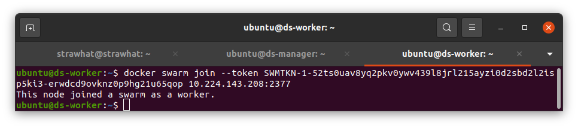
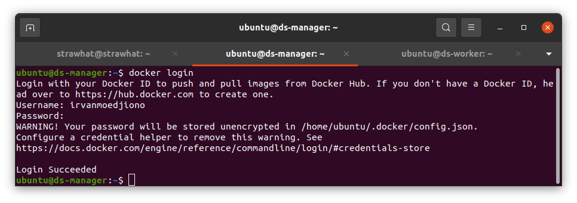

## Docker Swarm

- Buat 2 Buah server untuk manager dan worker

<p align="center"></p>

- install docker dan docker compose menggunakan ansible

<p align="center"></p>

<p align="center"></p>

- lakukakn inisialisasi manager dan worker dari docker swarm

`docker swarm init --advertise-addr ip-server`

- untuk inisialisasi server worker tinggal copy command `docker swarm join...` kedalam server yang ingin kita jadikan worker

<p align="center"></p>

- cek node dengan perintah `docker node ls`

<p align="center"></p>

- lakukan docker login pada semua server agar dapat pull image dockerhub kita

<p align="center"></p>

- lakukan clone aplikasi microservice

`git clone https://github.com/IrvanMoedjiono/dumbways-microservices.git`

<p align="center"></p>

- isi docker-compose.yml

```
version: '3'

services:
    mongo:
        image : mongo
        container_name: mongo
        environment:
        - PUID=1000
        - PGID=1000
        volumes:
        - /home/ubuntu/mongo/database:/data/db
        ports:
        - 27017:27017
        restart: unless-stopped

    todo-profile:
        build: ./profile
        command: "ts-node /app/src/server"
        image: irvanmoedjiono/todo-profile:1.0
        restart: always
        container_name: todo-profile
        ports:
        - 5001:5001
    
    todo-services:
        build: ./services
        command: "node /app/src/server.js"
        image: irvanmoedjiono/todo-services:1.0
        restart: always
        container_name: todo-services
        ports:
        - 4000:4000
    
    todo-skill:
        build: ./skill
        command: "ts-node /app/src/server"
        image: irvanmoedjiono/todo-skill:1.0
        restart: always
        container_name: todo-skill
        ports:
        - 5000:5000

    todo-todo:
        build: ./todo
        command: "ts-node /app/src/server"
        image: irvanmoedjiono/todo-todo:1.0
        restart: always
        container_name: todo-todo
        ports:
        - 5002:5002

    todo-user:
        build: ./user
        command: "ts-node /app/src/server"
        image: irvanmoedjiono/todo-user:1.0
        restart: always
        container_name: todo-user
        ports:
        - 7000:7000
```

- deploy service menggunakan perintah 

`docker stack deploy --compose-file docker-compose.yml nama-stack`

- cek service dengan perintah `docker service ls`

<p align="center"></p>

- cek container apakah suda ter-deploy dengan perintah `docker ps`

<p align="center"></p>
<p align="center"></p>

- scale/replika aplikasi dengan perintah

`docker service scale nama-servce=jumlah-scale`

<p align="center"></p>
