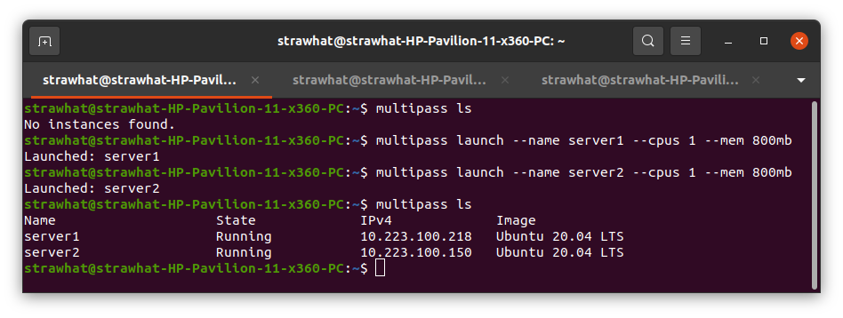
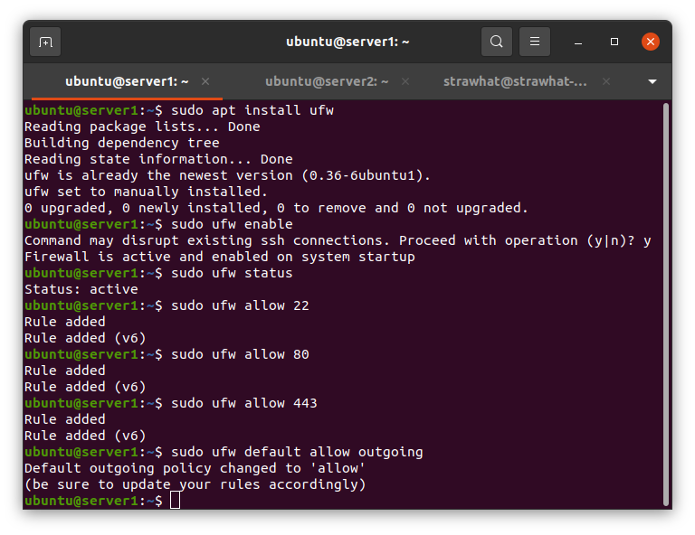
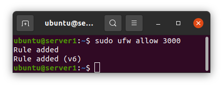

## Creating 2 server multipass

- `multipass launch --name server1 --cpus 1 --mem 800mb` : untuk membuat server1
- `multipass launch --name server2 --cpus 2 --mem 800mb` : untuk membuat server2

## Setup Firewall

- `sudo apt install ufw` : untuk menginstall firewall iptables/ufw
- `sudo ufw enable` : untuk mengaktifkan firewall
- `sude ufw status` : untuk melihat status firewll
- `sudo ufw allow 22` : untuk mengizinkan akses port 22
- `sudo ufw allow 80` : untuk mengizinkan akses port 80
- `sudo ufw allow 443` : untuk mengizinkan akses port 443

- `sudo ufw allow 3000` : untuk megizinkan akses aplikasi yang berjalan di port 3000

