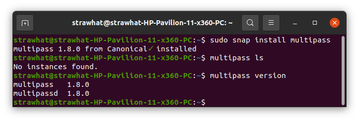
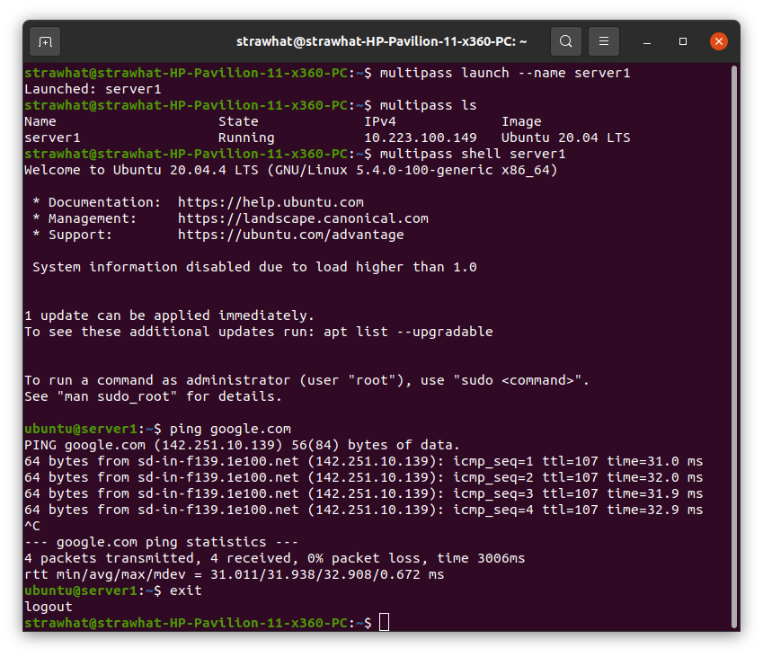
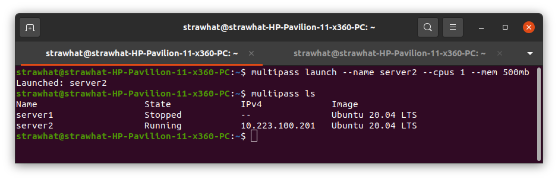
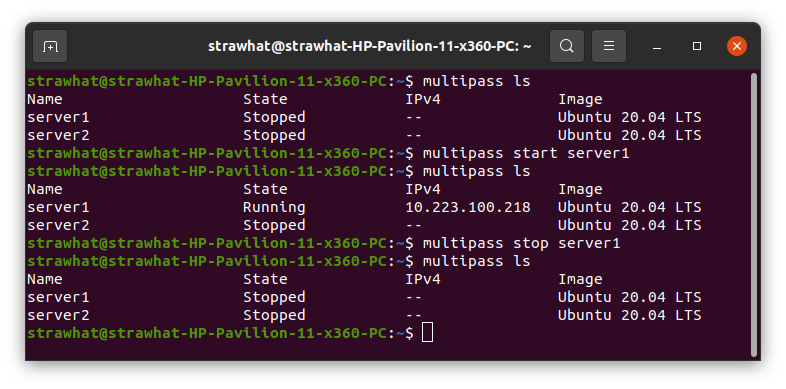
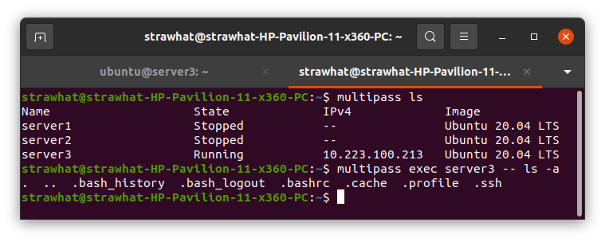
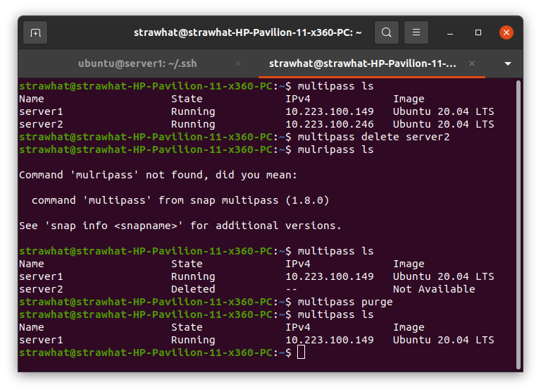
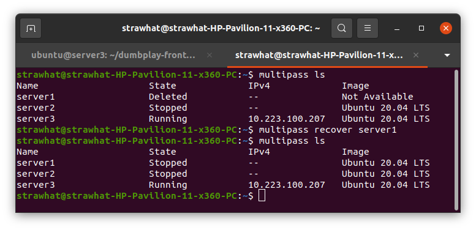

## Multipass Command

- `sudo snap install multipass` : untuk menginstall multipass
- `multipass ls` : untuk menampilkan daftar dari server multipass
- `multipass version` : untuk melihat versi multipass yang terinstall

- `multipass launch --name nama-server` : untuk membuat server multipass dengan nama tertentu
- `multipass shell nama-server` : untuk menjalankan dan masuk ke dalam shell server multipass

- `multipass launch --name nama-server --cpus jumlah-core --mem jumlah-RAM` : untuk membuat server sesuai kebutuhan cpu dan RAM

- `multipass start nama-server` : untuk menjalankan server multipass dengan nama tertentu
- `multipass start --all` : untuk menjalankan semua server multipass
- `multipass stop nama-server` : untuk menghentikan server multipass dengan nama tertentu
- `multipass stop --all` : untuk menghentikan semua server multipass

- `multipass exec nama-server -- perintah-shell-server-tersebut` : untuk membuat perintah pada server tujuan tanpa masuk ke shell server tersebut / masih pada local

- `multipass delete nama-server` : untuk menghapus server dengan nama tertentu
- `multipass delete --all` : untuk menghapus semua server multipass yang ada
- `multipass purge` : untuk menghilangkan secara permanen server yang berstatus delete
- `multipass recover nama-server` : untuk mengembalikan server yang berstatus delete

