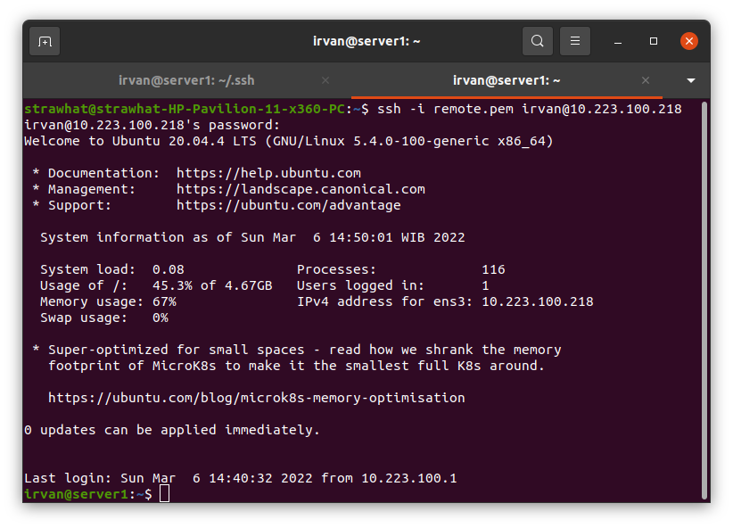

## Remote Server

langkah pertama yaitu dengan melakukan perubahan seperti dibawah ini

- `sudo nano /etc/ssh/sshd_config` : lakukan perubahan seperti gambar dibawah ini

- `sudo systemctl restart sshd` : untuk merestart system ssh agar konfigurasi yang baru dibuat diterapkan

Remote server ada 2 cara

### Cara 1

- `ssh nama-server@ip-server` : untuk remote server yang disebut

### Cara 2

Menggunakan file.pem

- masuk kedalam server yang ingin diremote
- `ssh-keygen` : membuat ssh key
- `cd .ssh` : masuk ke direktori penyimpanan ssh key
- `cat id_rsa` : melihat ssh key. Copy semua isi file id_rsa.

- kembali ke local
- `nano remote.pem` : membuat file remote.pem dan masukkan ssh key yang telah dicopy kedalam file remote.pem, lalu save dan keluar.

- `chmod 400 remote.pem` : membuat file remote.pem agar hanya bisa dibaca

- `ssh -i remote.pem nama-server@ip-server` : untuk remote server menggunakan file.pem

