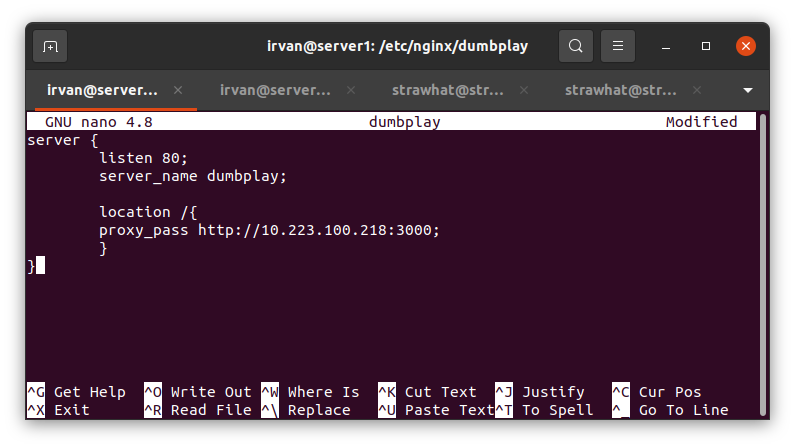
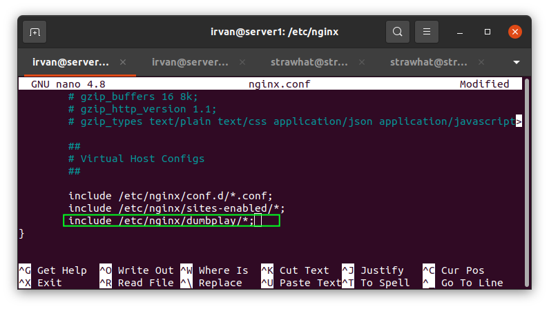
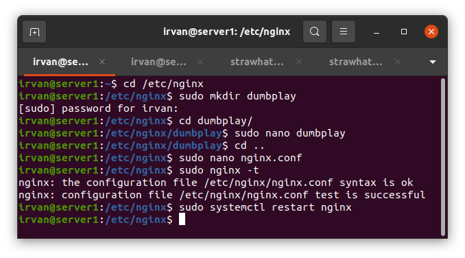
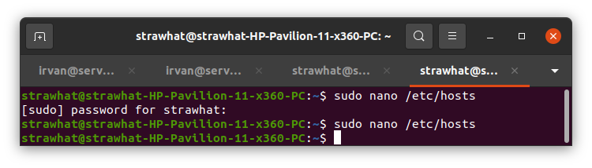
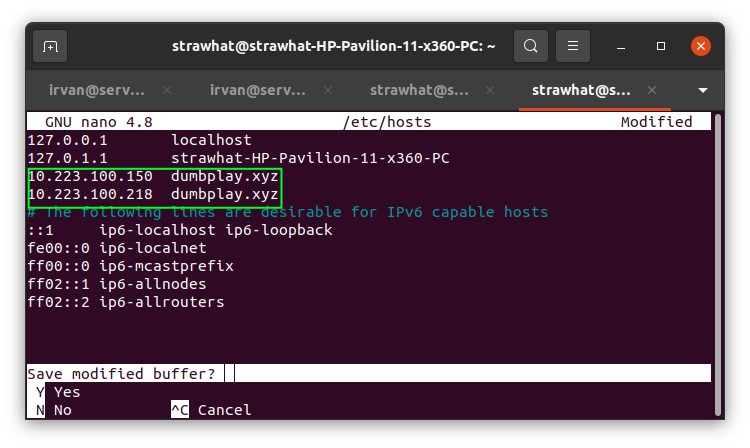

## Reverse Proxy

- `cd /etc/nginx` : masuk kedalam direktori nginx
- `cd dumbplay` : masuk kedalam direktori dumbplay
- `sudo mkdir dumbplay` : buat direktori untuk konfigurasi nginx
- `sudo nano dumbplay` : buat file konfigurasi dan masukkan script seperti gambar dibawah

- `cd ..` : keluar direktori dumbplay menuju direktori sebelumnya / nginx
- `sudo nano nginx.conf` : masukkan `include /etc/nginx/dumblpay/*;` agar semua konfigurasi pada direktori dumbplay terbaca system nginx

- `sudo nginx -t` : memeriksa syntax konfigurasi nginx
- `sudo systemctl restart nginx` : merestart nginx agar konfigurasi yang baru dibuat terbaca

## Virtual Domain

- `sudo nano /etc/hosts` : tambahkan virtual domain seperti gambar dibawah

- buka web browser dan masukkan domain `dumbplay.xyz`

