## Git on Server

- `git version` : untuk mengecek versi git
- `sudo apt install git` : apabila belum terinstall bisa menggunakan perintah tersebut
- `git config --global user.name "nama-username-akun-github"` : untuk konfigurasi username akun github pada komputer kita
- `git config --global user.email "email-akun-github` : untuk konfigurasi email akun github pada komputer kita
- `git config --list` : untuk menampilkan konfigurasi kita

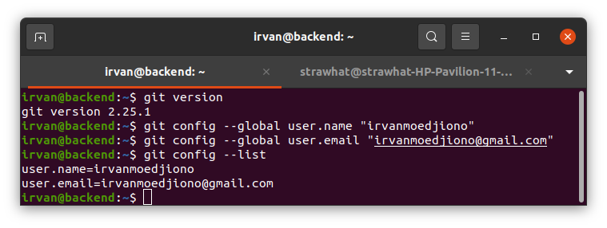

### Menyambungkan git pada komputer menggunakan ssh key

- `ssh-keygen` : untuk membuat ssh key

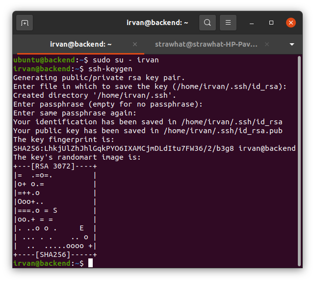

- `cd .ssh` : untuk masuk direktori penyimpanan ssh key
- `cat id_rsa.pub` : buka file id_rsa.pub lalu copy semua isi dalam file tersebut

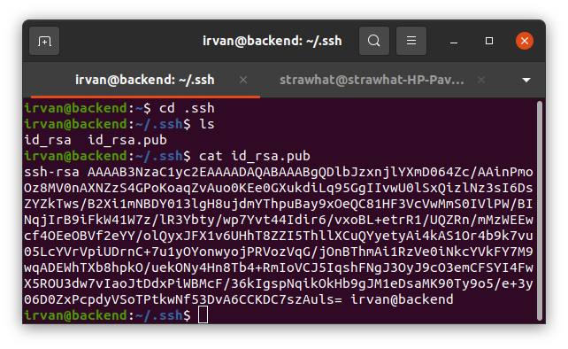

- masuk ke akun github lalu pilih settings seperti pada gambar dibawah 

- pilih SSH and GPG keys

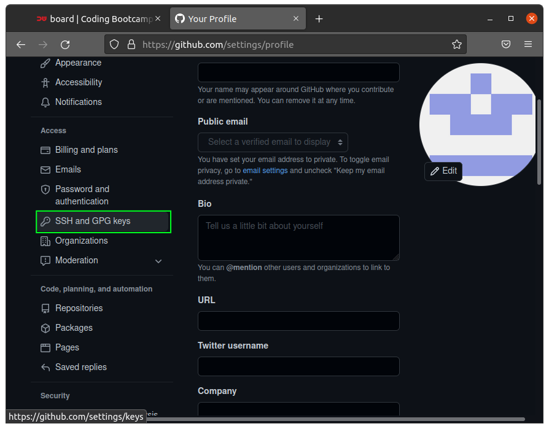

- pilih New SSH key

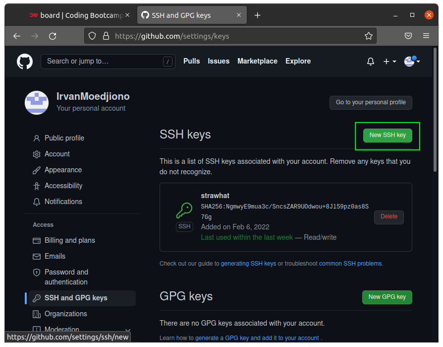

- masukkan password akun github

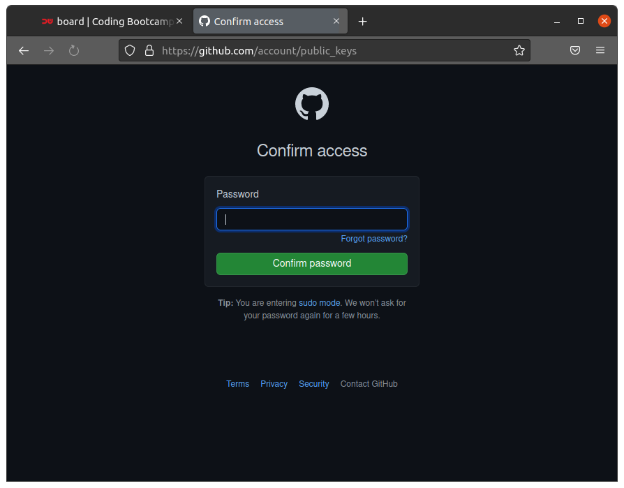

- isi tille sesuai keinginan kita dan paste ssh yang telah di-copy ke bagian key.

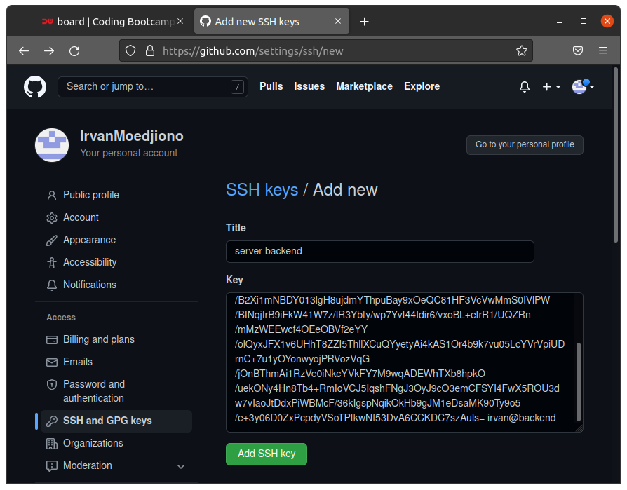

- komputer sudah tersambung ke github

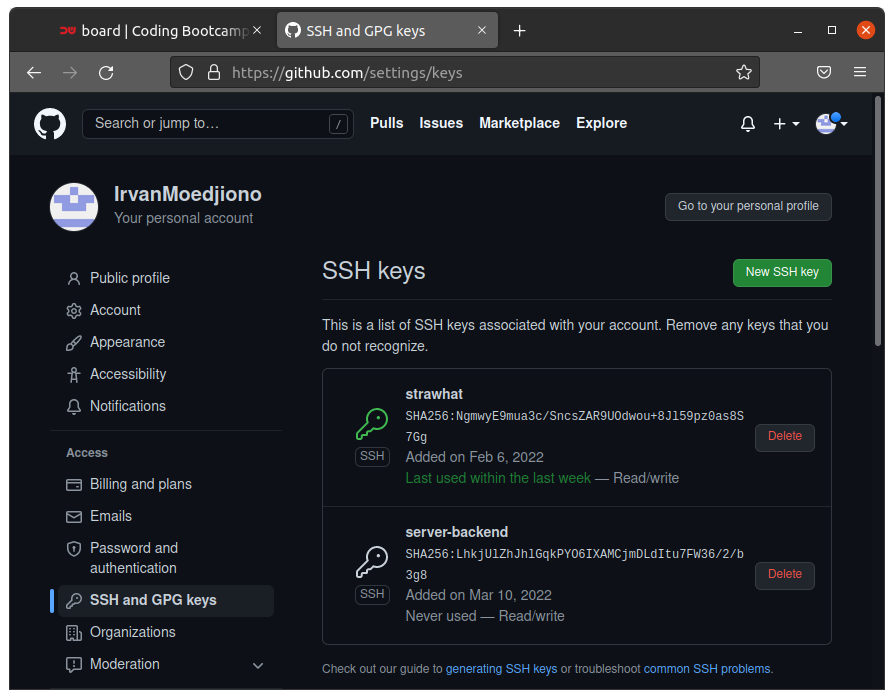

### Using Git on Terminal

- buat repositori pada github dengan cara klik pada new repositori

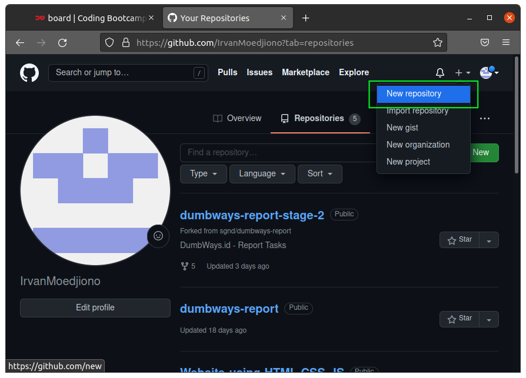

- masukkan nama repositori dan pilih public/private lalu klik creat repositori

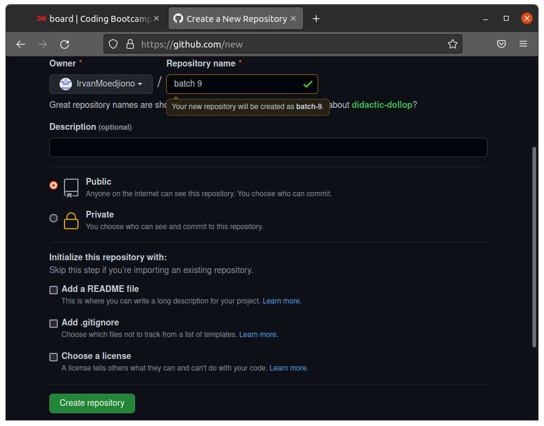

- maka akan tampil ssh repositori dan copy ssh tersebut 

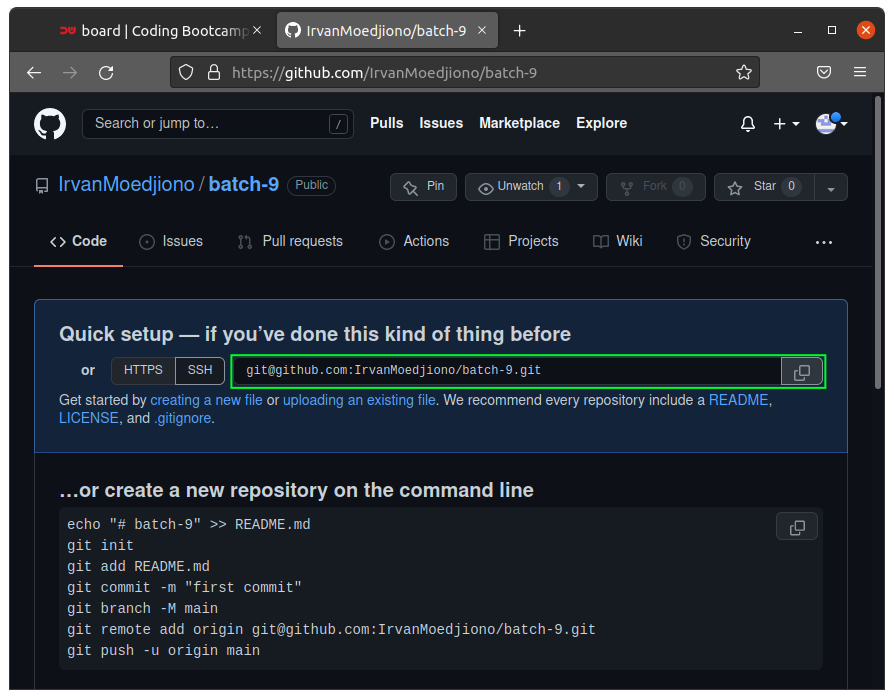

- `git init nama-direktori` : untuk membuat direktori beserta inisialisasi direktori tersebut
- `git init` : unutk inisialisasi direktori yang telah ada dan berada dalam direktori tersebut

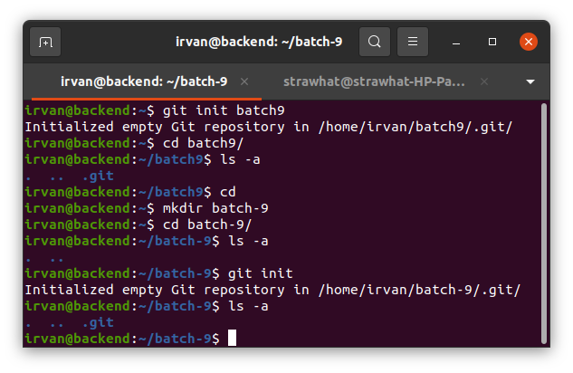

- `git reote add nama-remote ssh-repositori` : untuk meremote repositori
- `git remote -v` : untuk menampilkan daftar remote pada direktori

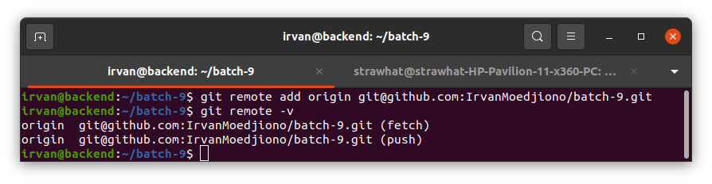

- buat file pada direktori -> `git add .` : untuk menambahkan perubahan agar siap untuk commit
- `git commit -m "nama-comiit"` : untuk commit perubahan agar siap unutk di-push
- `git push nama-remote nama-branch` : untuk push perubahan pada github

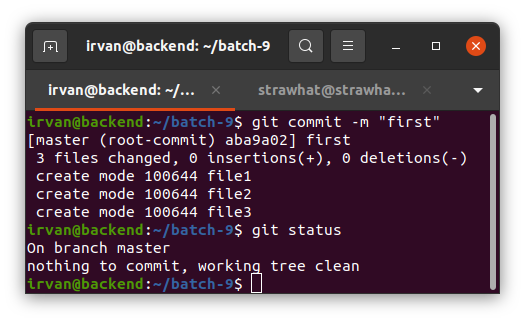

