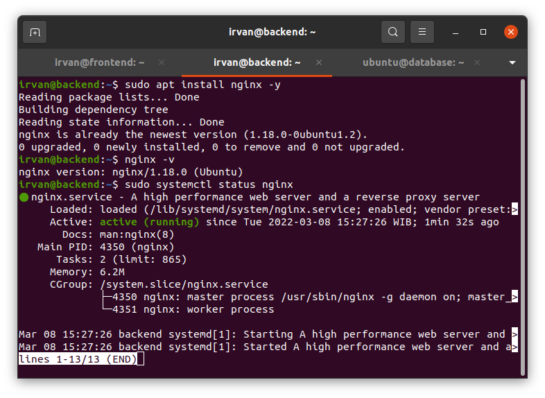
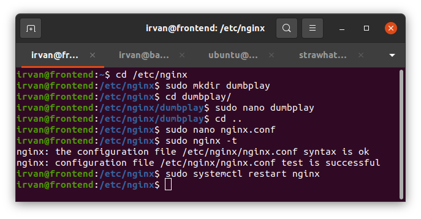
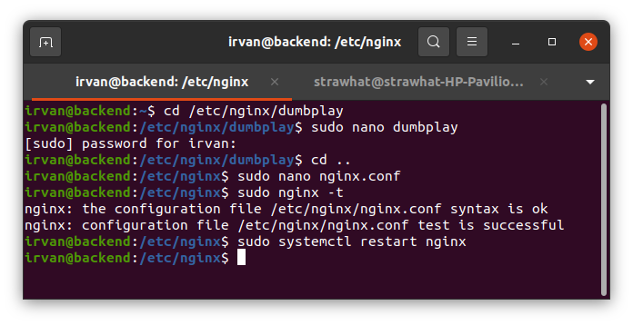
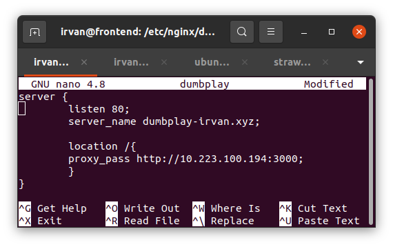
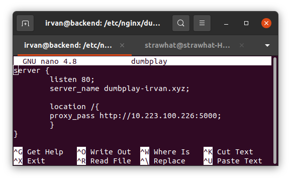
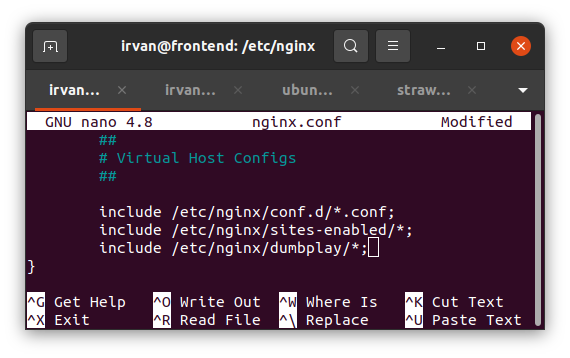
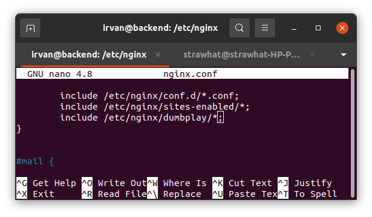

## Reverse Proxy

- install web server nginx pada server frontend dan backend
- cek versi dan status system nginx

Server Frontend

Server Backend

- buka direktori system nginx
- buat dan masuk direktori konfigurasi pada dir nginx
- buat file konfigurasi seperti gambar dibawah ini lalu save dan keluar

Server Frontend

Server Backend

- kembali ke direktori nginx
- buka dan tambahkan konfigurasi pada file nginx.conf seperti gambar dibawah ini lalu save dan keluar

Server Frontend

Server Backend

- restart system nginx

