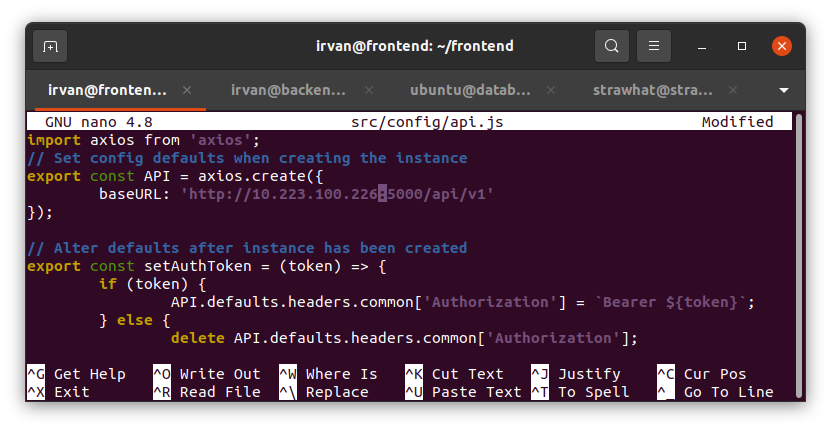

## Setup Backend

- buat dan jalankan 3 server frontend, backend, dan database.

- lakukan update dan upgrade sistem operasi ketiga server

- buat user baru pada server frontend dan backend  serta inisialisai user tersebut agar bisa akses root

- install firewall ufw pada server frontend dan backend
- eneble firewall
- konfigurasi allow firewall port 22, 80, 443, 3000 pada server frontend
- konfigurasi allow firewall port 22, 80, 443, 5000 pada server backend

- download resource node js nvm dan `exec bash` agar terbaca

- install nvm versi 14 dan pm2

- clone menggunakan perintah `git clone https://github.com/dumbwaysdev/dumbplay-backend.git`
- rubah nama direktori menjadi backend
- install module menggunakan perintah `npm install`

- copy file .env-copy dengan nama .env

- buka file config.json `sudo nano config/config.json`
- rubah file config.json beerdasarkan database yang telah dibuat seperti pada gambar di bawah ini

- install sequelize untuk migrasi file ke server database dengan perintah `npm install -g sequelize-cli`

- migrasi file dengan perintah `npx sequelize db:migrate`

- cek database pada server database apakah file sudah migrasi

- masuk pada server frontend dan rubah konfigurasi pada api.js dengan perintah `sudo nano src/config/api.js`
- rubah ip localhost menjadi ip server backend kemudian save dan keluar

- jalankan aplikasi pada server backend menggunakan pm2

- masuk web browser lalu masukkan alamat ip server backend beserta port 5000

- jalankan aplikasi pada server frontend menggunakan pm2

- masuk web browser lalu masukkan alamat ip server frontend beserta port 3000
- jika aplikasi dapat login dan register maka ketiga server telah terhubung

