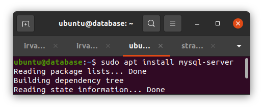
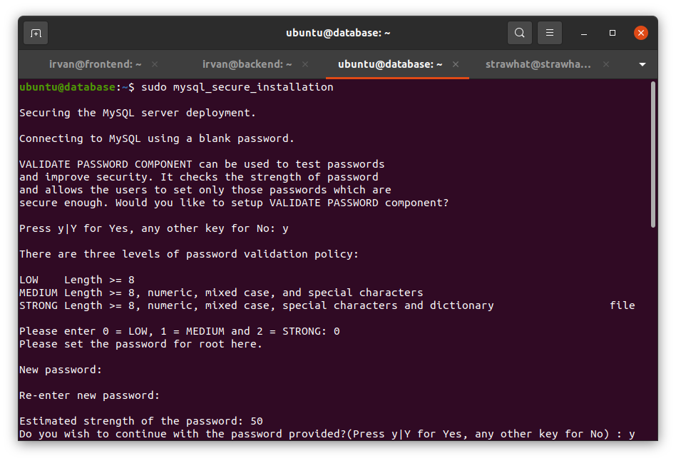
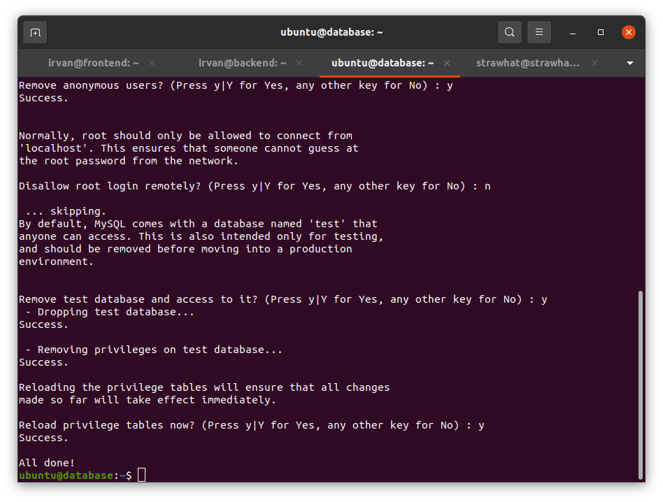
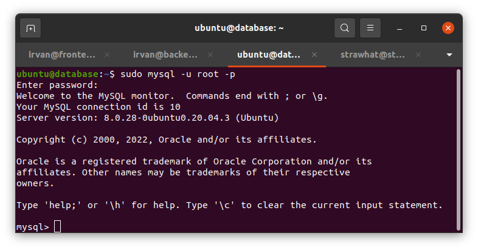
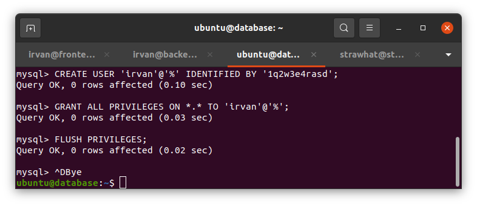
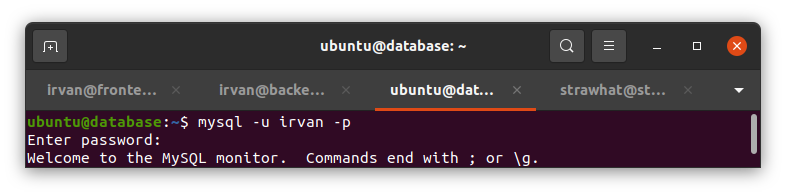
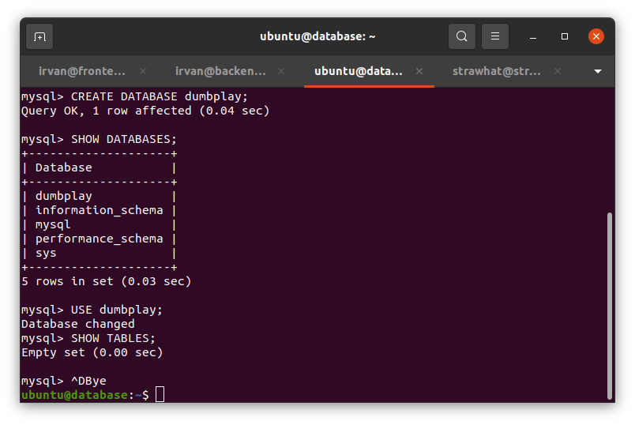
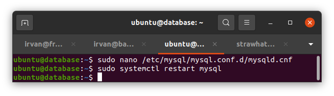
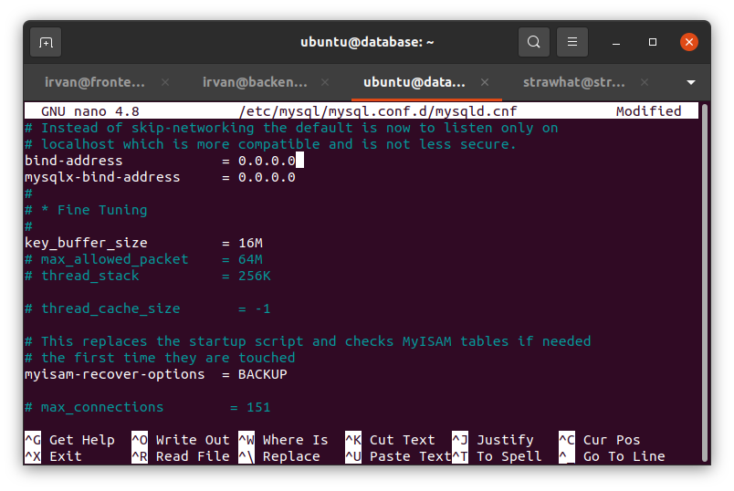

## Setup Server Database

- `sudo apt install mysql-server` : untuk menginstall mysql server

- `sudo mysql_secure_installation` : untuk membuat password dan mengamankan mysql

- `sudo mysql -u root -p`: untuk masuk ke user root mysql

- `CREATE USER 'NAMA-USER'@'%' IDENTIFIED BY 'PASSWORD';` : untuk membuat user baru pada database mysql
- `GRANT ALL PRIVILEGES ON *.* TO 'USERNAME'@'%';` : untuk mengizinkan user memiliki semua hak akses mysql
- `FLUSH PRIVILEGES;` : untuk mereload privileges
- CTRL+D : untuk keluar dari mysql

- `mysql -u nama-user -p` : untuk masuk pada user mysql tertentu

- `CREATE DATABASE NAMA-DATABASE;` : untuk membuat database baru pada mysql
- `SHOW DATABESES;` : untuk melihat daftar database 
- `USE nama-database` : untuk menggunakan database yang ada 
- `SHOW TABLES;` : untuk menampilkan isi database

### Konfigurasi system mysql

- `sudo nano /etc/mysql/mysql.conf.d/mysqld.cnf` : membuka file mysqld.cnf dan edit konfigurasi
- rubah ip pada bind-address dan mysqlx-bind-address menjadi 0.0.0.0
- `sudo systemctl restart mysql` : untuk merestart mysql agar konfigurasi baru diterapkan

