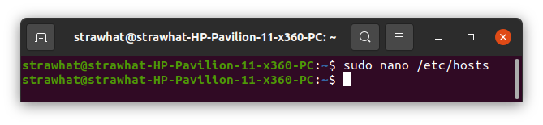
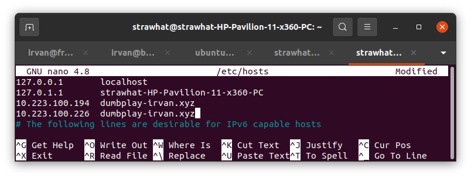
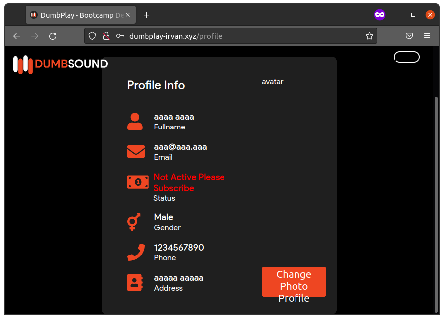

## Virtual Domain

- tambahkan ip server frontend dan backend beserta server_name pada file /etc/hosts dengan perintah `sudo nano /etc/hosts` di local komputer

- tambahkan seperti gambar di-bawah ini

- buka web browser dan masukkan virtual domain

