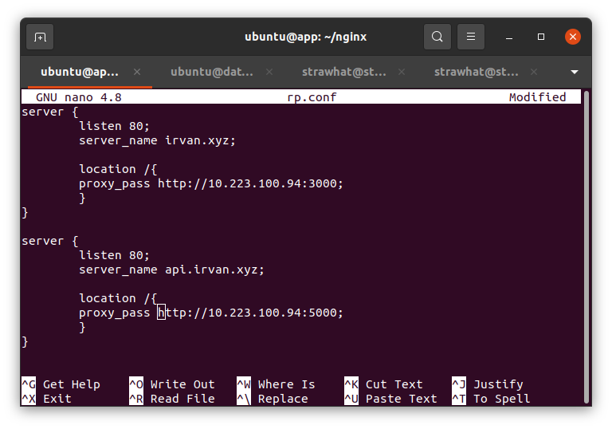
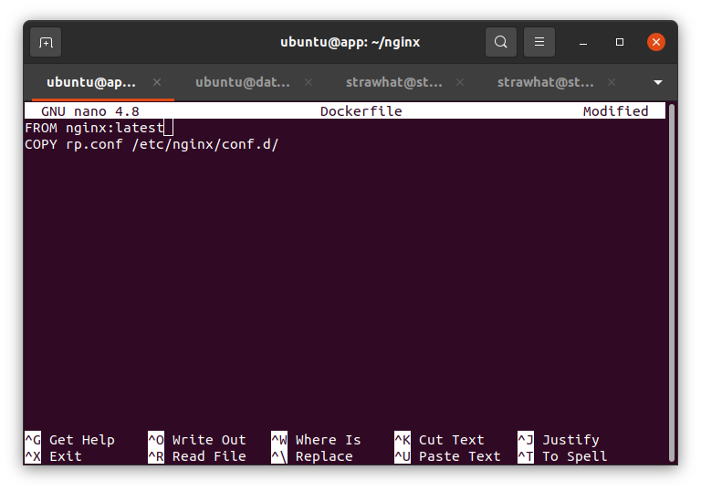
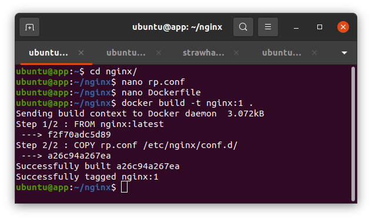
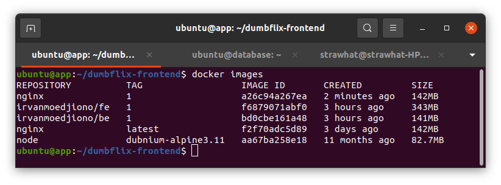
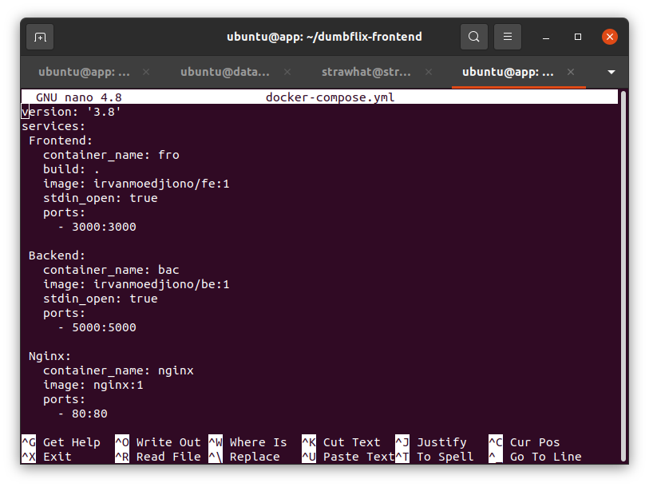
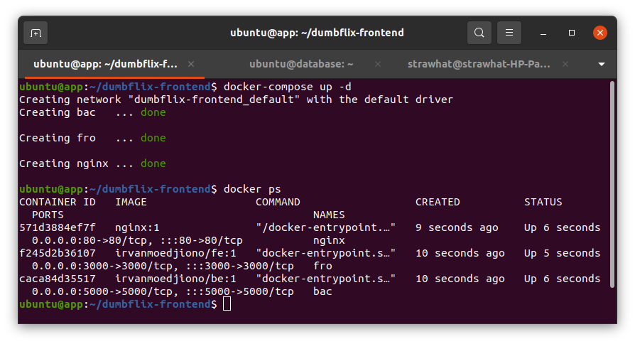
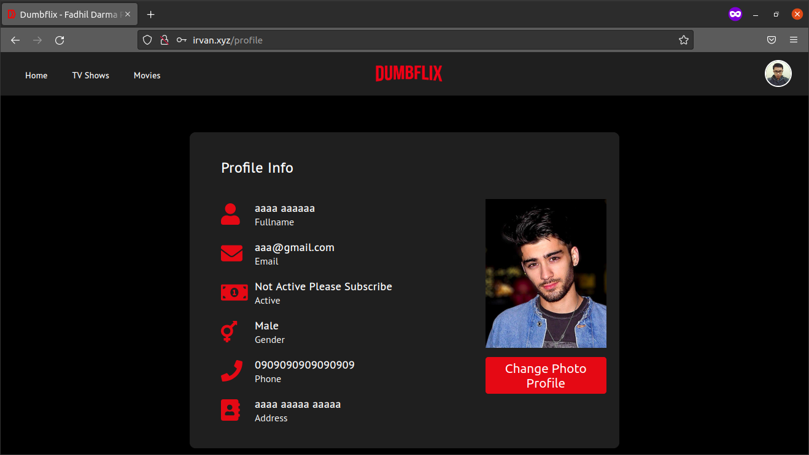
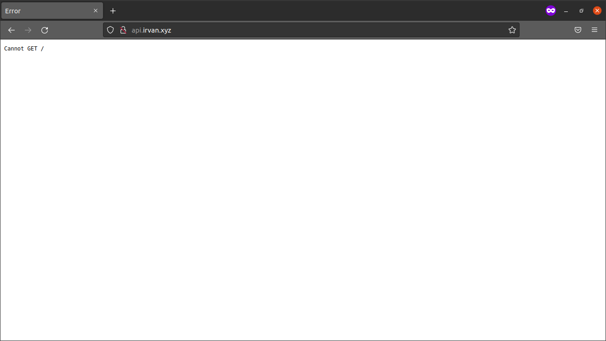

## Reverse Proxy

- buat direktori nginx untuk membuat image docker nginx

- buat file configurasi reverse proxy dengan nam rp.conf

- buat file Dockerfile untuk build image nginx

- build dengan perintah `docker build -t nginx:1`

## Deploy Application

- Cek image docker

- Buat file docker-compose.yml seperti pada gambar

- lakukan deploy dengan perintah `docker-compose up -d`

- aplikasi dumbflix sudah terdeploy

