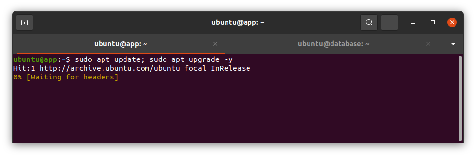
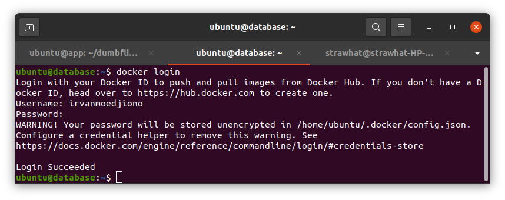

## Installation Docker on Server

- Buat 2 buah server dengan nama app & database

<p align="center"></p>

- Update & upgrade system operasi 

<p align="center"></p>

- Install ca-certificates, curl, gnupg, dan lsb -release

```
sudo apt-get install \
    ca-certificates \
    curl \
    gnupg \
    lsb-release
```

- Download resource docker 

```
curl -fsSL https://download.docker.com/linux/ubuntu/gpg | sudo gpg --dearmor -o /usr/share/keyrings/docker-archive-keyring.gpg
```

- Menambahkan gpg key dan repositori docker

```
echo \
  "deb [arch=$(dpkg --print-architecture) signed-by=/usr/share/keyrings/docker-archive-keyring.gpg] https://download.docker.com/linux/ubuntu \
  $(lsb_release -cs) stable" | sudo tee /etc/apt/sources.list.d/docker.list > /dev/null
```
<p align="center"></p>

- Update system

`sudo apt update`

- Install docker engine 

`sudo apt-get install docker-ce docker-ce-cli containerd.io`

<p align="center"></p>

- Cek versi docker dan beri izin user ubuntu agar bisa melakukan perintah docker tanpa sudo

`docker -v`

`sudo usermod -aG docker nama-user`

<p align="center"></p>

- download docker compose 

```
sudo curl -L "https://github.com/docker/compose/releases/download/1.29.2/docker-compose-$(uname -s)-$(uname -m)" -o /usr/local/bin/docker-compose
```

- merubah izin akses agar bisa execute docker compose

`sudo chmod +x /usr/local/bin/docker-compose`

<p align="center"></p>

- login ke akun dockerhub

`docker login` > masukkan username dan password dockerhub

<p align="center"></p>
