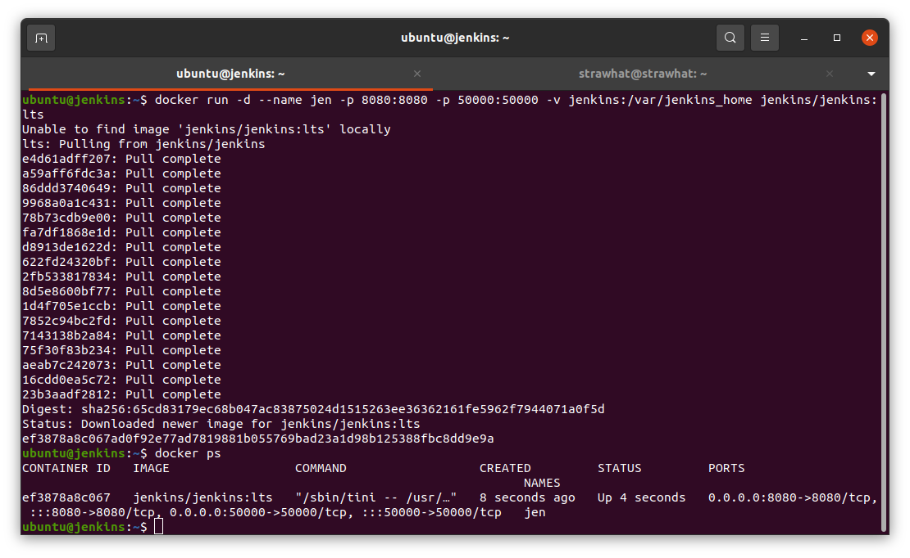

## Installasi Jenkins menggunakan docker 

- lakukan perintah dibawah ini

```
docker run --name nama-container -p 8080:8080 -p 50000:50000 -v jenkins:/var/jenkins_home jenkins/jenkins:lts
```

<p align="center"></p>

- setelah container jalan, akses jenkins pada web browser dengan ip-server:8080
- ketik perintah `docker container logs nama-container-jenkins`. lalu copy administrator password
- masukkan administrator password

<p align="center"></p>

- pilih install suggested plugin dan tunggu hingga semua plugin terinstall

<p align="center"></p>

- masukkan username dan password untuk jenkins

<p align="center"></p>

- pada jenkins url bisa langsung skip

<p align="center"></p>

- setelah masuk dashboard jenkins tambahkan plugin `SSH Agent` dan `Publish Over SSH`

<p align="center"></p>

- centang bagian restart jenkins agar jenkins merestart setelah proses installasi plugin tambahan selesai

<p align="center"></p>

- Buat reverse proxy agar kita memudahkan kita masuk dashboard jenkins tanpa perlu memasukkan ip-server dan port 8080

<p align="center"></p>
