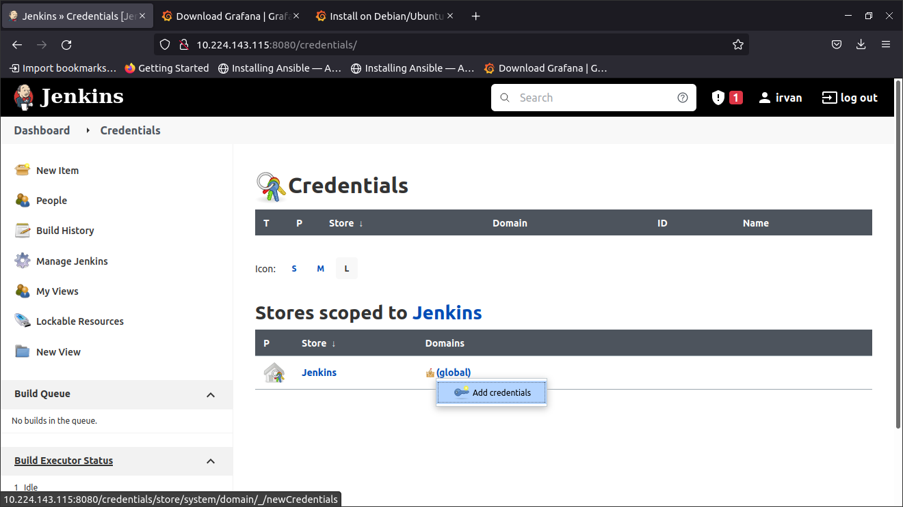
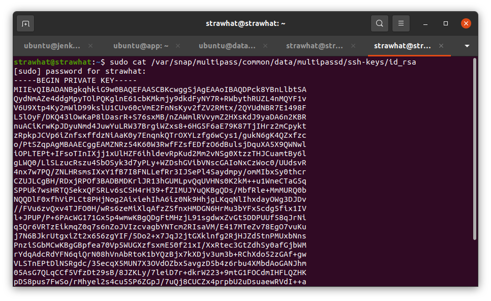
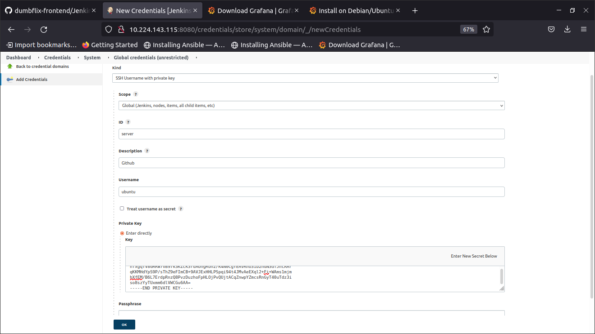
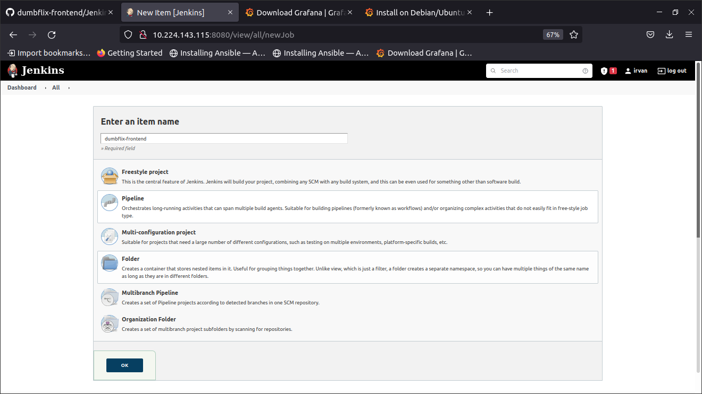
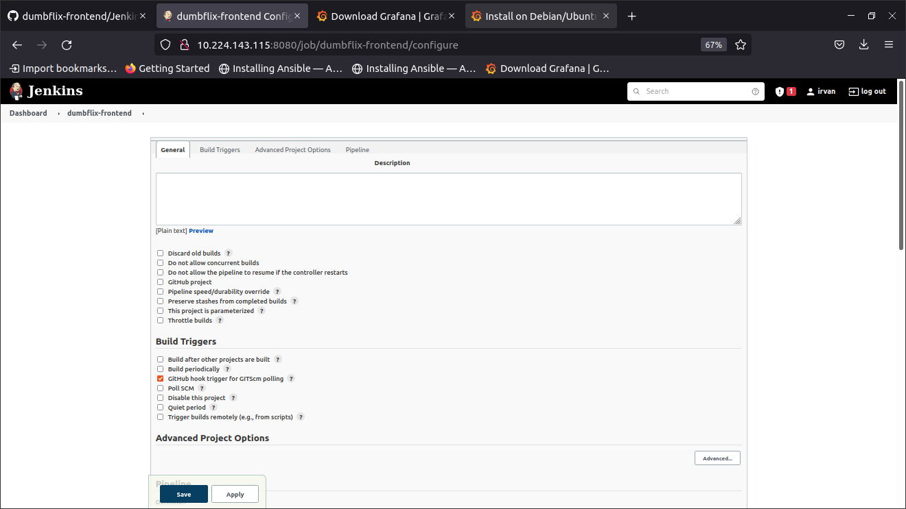
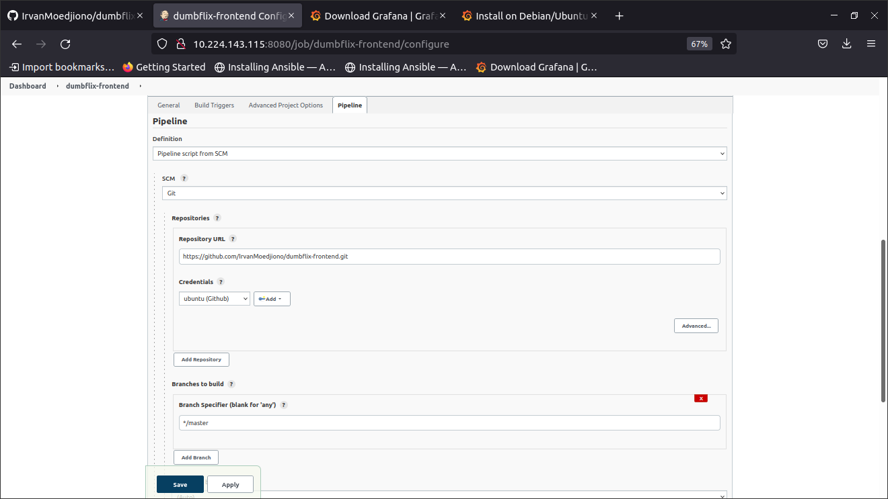
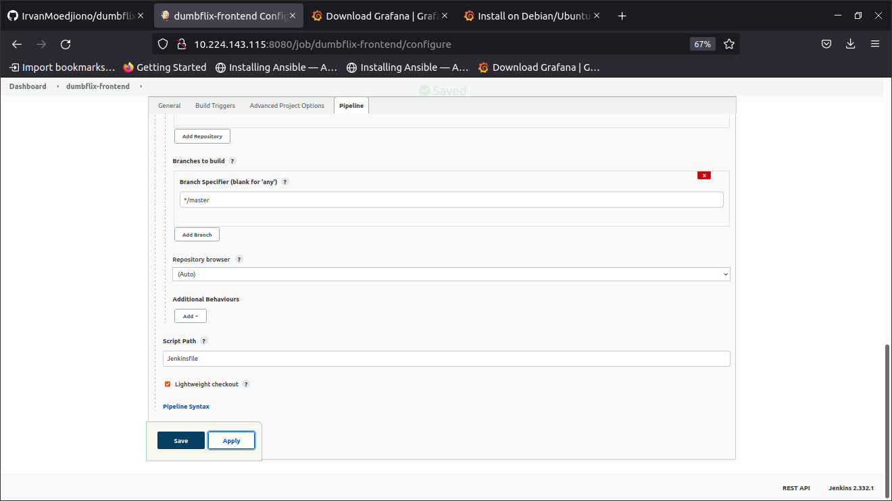
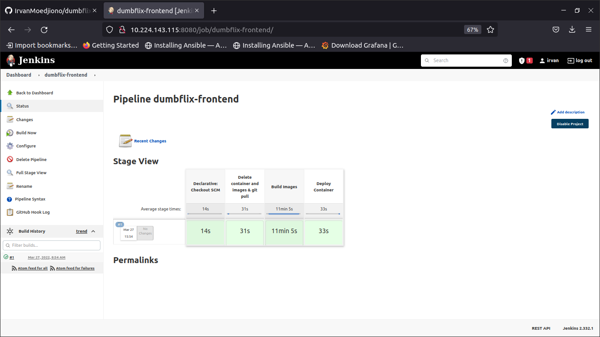

## Jenkins Credential

- Tambahkan credential baru

<p align="center"></p>

- masukkan private key kedalam credential

<p align="center"></p>

<p align="center"></p>

## Jenkins Pipeline Job

- Buat job baru dengan pilihan pipeline

<p align="center"></p>

- centang bagian `GitHub hook trigger for GITScm polling` agar dapat melakukan webhook

<p align="center"></p>

- pilih `Pipeline script from SCM`
- SCM pilih Git
- masukkan url repositori github
- pilih credential
- masukkan branch yang ingin kita build

<p align="center"></p>

- pada Script Path masukkna nama file script pipeline yang ingin kita buat. Untuk mempermudah beri nama `Jenkinsfile`. Kemudian apply dan save

<p align="center"></p>

- buat file Jenkinsfile pada direktori aplikasi yang ingin kita deploy

```
def secret = 'server'
def server = 'ubuntu@10.224.143.122'
def dir = 'dumbflix-frontend'
def branch = 'master'

pipeline{
	agent any
	stages{
		stage ('Delete container and images & git pull'){
			steps{
				sshagent([secret]) {
					sh """ssh -o StrictHostKeyChecking=no ${server} << EOF
					cd ${dir}
					docker-compose down 
					docker system prune -f
					git pull origin ${branch}
					exit
					EOF"""
				}
			}
		}
	stage ('Build Images'){
                        steps{
                                sshagent([secret]) {
                                        sh """ssh -o StrictHostKeyChecking=no ${server} << EOF
                                        cd ${dir}/nginx
					docker build -t nginx:re .
					cd ..
                                        docker-compose build
                                        exit
                                        EOF"""
                                }
                        }
                }
	stage ('Deploy Container'){
                        steps{
                                sshagent([secret]) {
                                        sh """ssh -o StrictHostKeyChecking=no ${server} << EOF
                                        cd ${dir}
                                        docker-compose up -d
                                        exit
                                        EOF"""
                                }
                        }
                }

	}
}
```

- Setelah membuat Jenkinsfile lakukan push ke dalam repositori Github
- Jalankan Build Now dan aplikasi sudah terdeploy secara otomatis tanpa masuk kedalam server

<p align="center"></p>
