## Make databse container 

- pull image database mysql

`docker pull mysql:8`

<p align="center">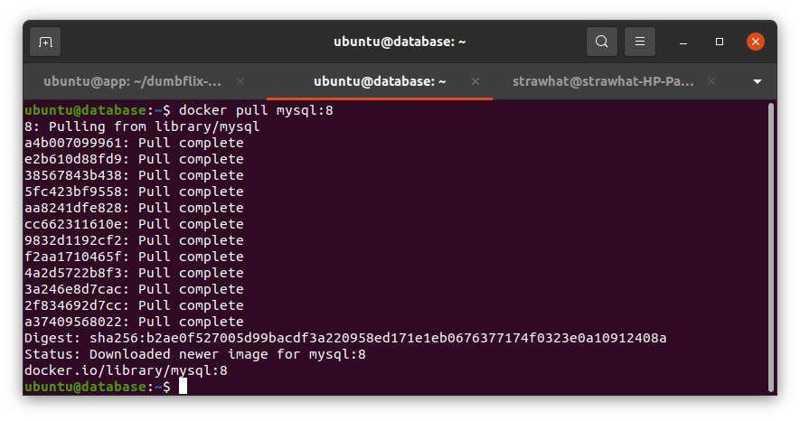</p>

- Setelah image berhasil terinstall buat container dengan perintah docker run. Tambahkan port, volume, dan environtment password & database

```
docker run -d --name nama-container -p 3306:3306 -v /home/ubuntu/mysql:/var/lib/mysql -e MYSQL_PASSWORD=password-anda -e MYSQL_DATABASE=nama-database mysql:8
```

<p align="center">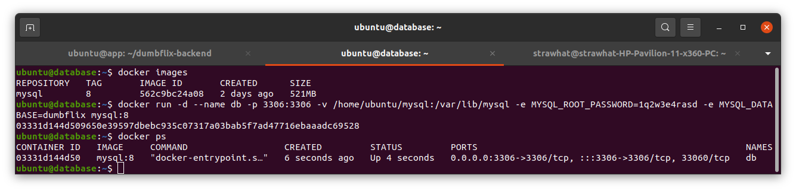</p>

## Make Docker Images

- Clone aplikasi dumbflix frontend & backend

```
git clone https://github.com/dumbwaysdev/dumbflix-frontend.git
```

```
git clone https://github.com/dumbwaysdev/dumbflix-backend.git
```

<p align="center">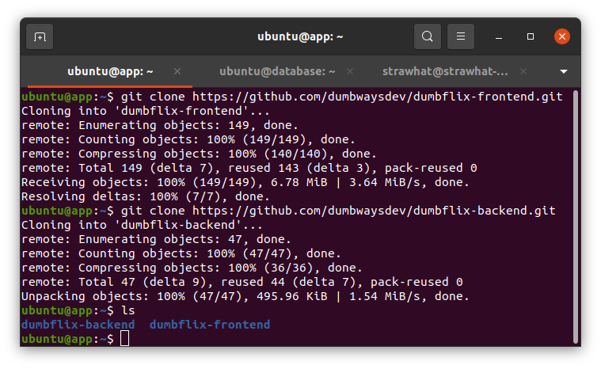</p>

- Masuk direktori frontend dan rubah baseURL pada file src/config/api.js menjadi ip dan port backend dumbflix

<p align="center"></p>

- Masuk direktori backend dan rubah database pada file config/config.json. Kemudian copy file .env.example menjadi .env

<p align="center">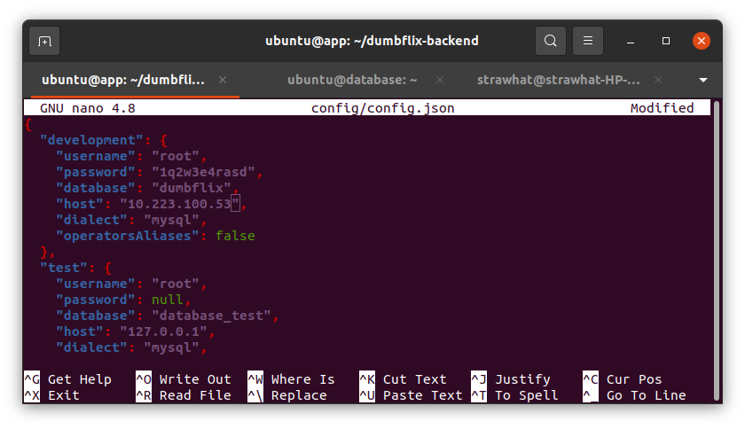</p>

<p align="center">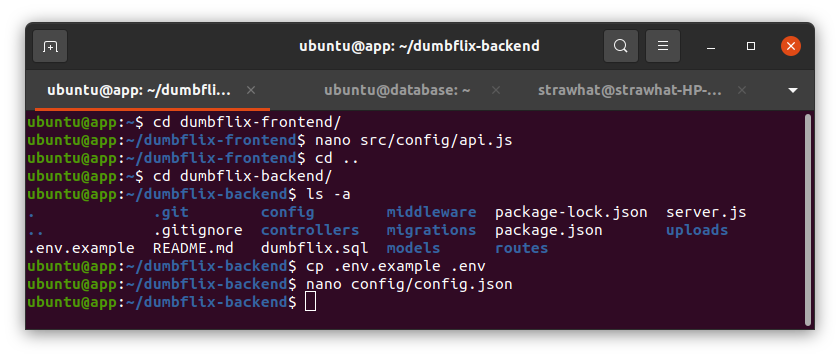</p>

- Buat Dockerfile untuk build image pada direktori frontend dan backend

<p align="center">Frontend</p>

<p align="center">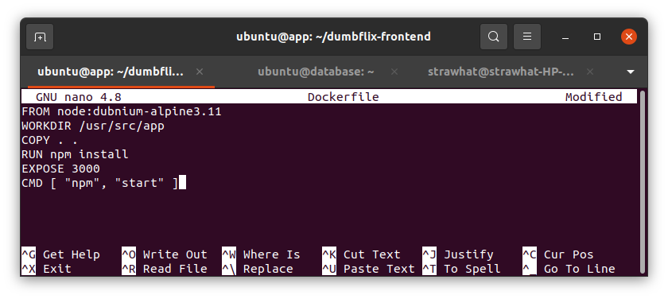</p>

<p align="center">Backend</p>

<p align="center">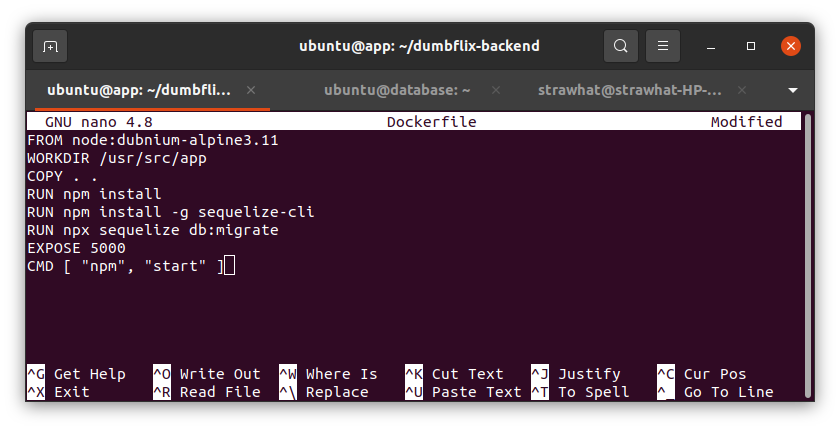</p>

- Build direktori Backend dan Frontend

<p align="center">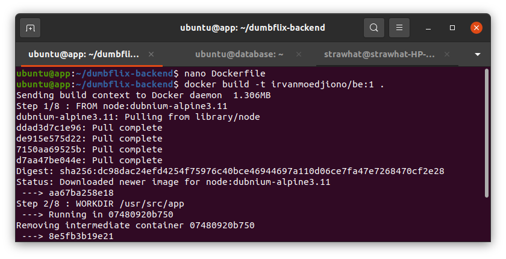</p>

- Cek apakah direktori migration pada backend sudah termigrate

<p align="center">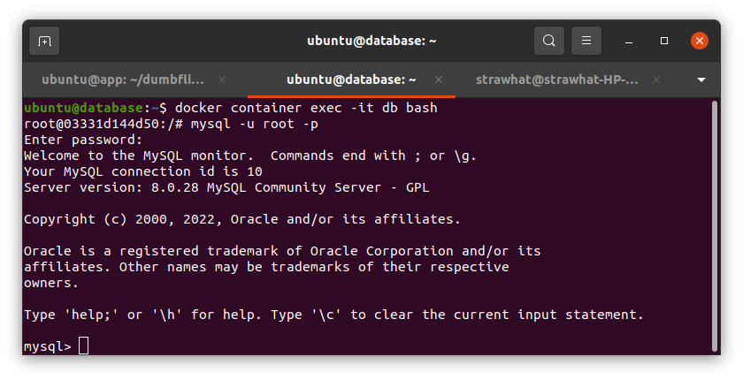</p>

<p align="center">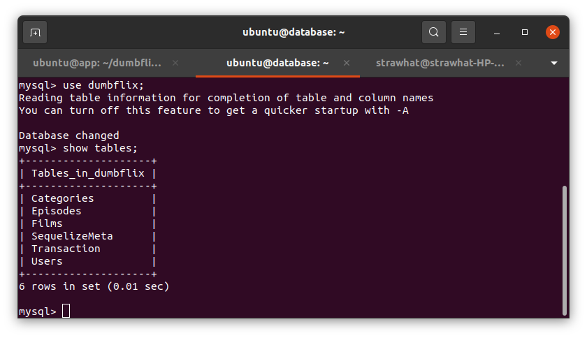</p>

- Cek image apakah sudah terbuat. Jika sudah terbuat lakukan push ke dockerhub

<p align="center">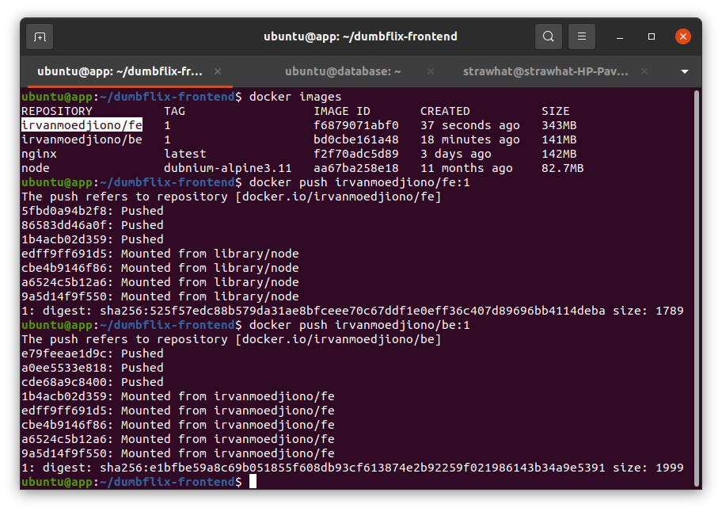</p>

<p align="center">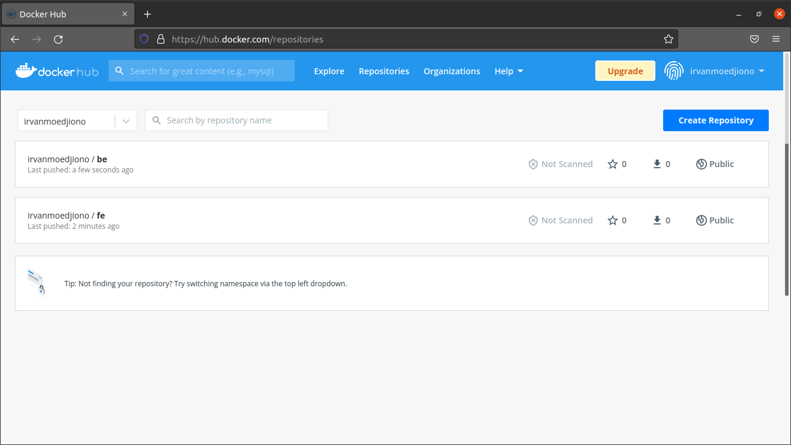</p>
