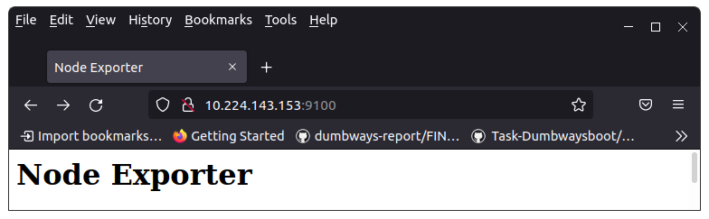
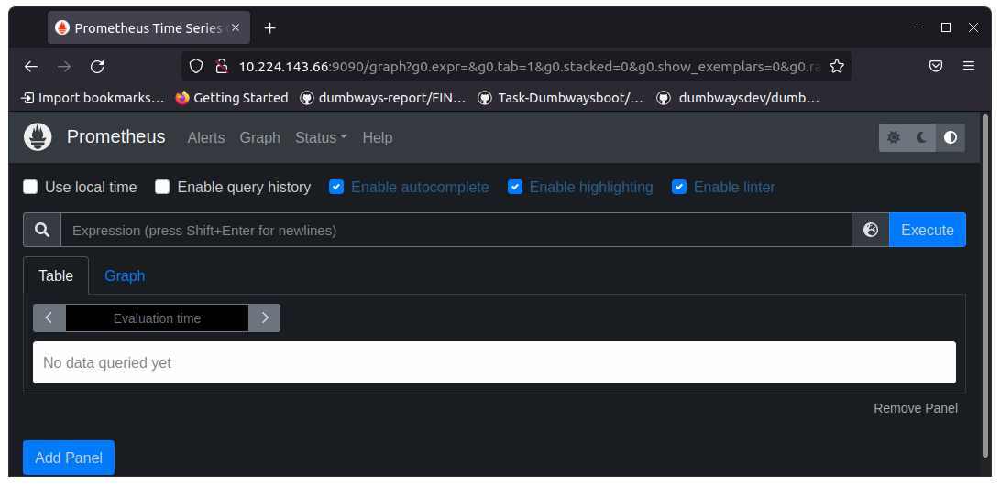
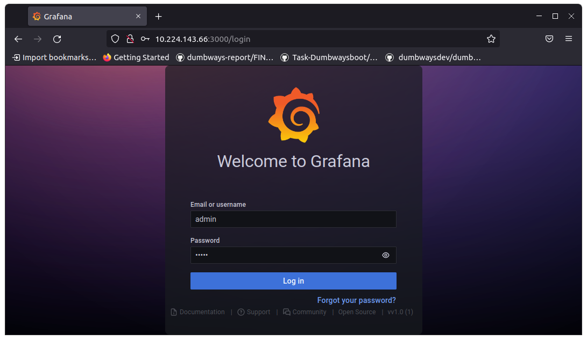
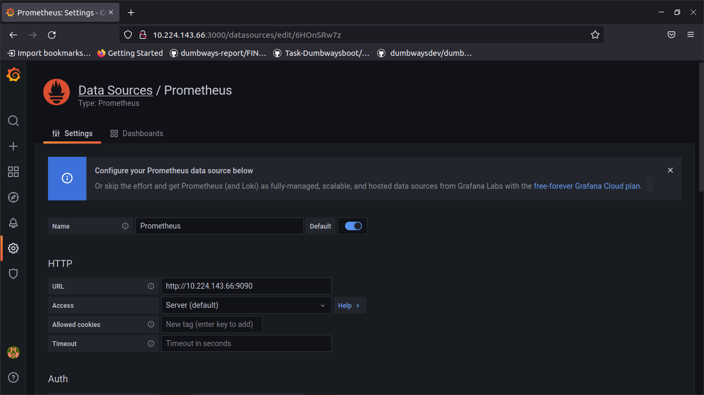
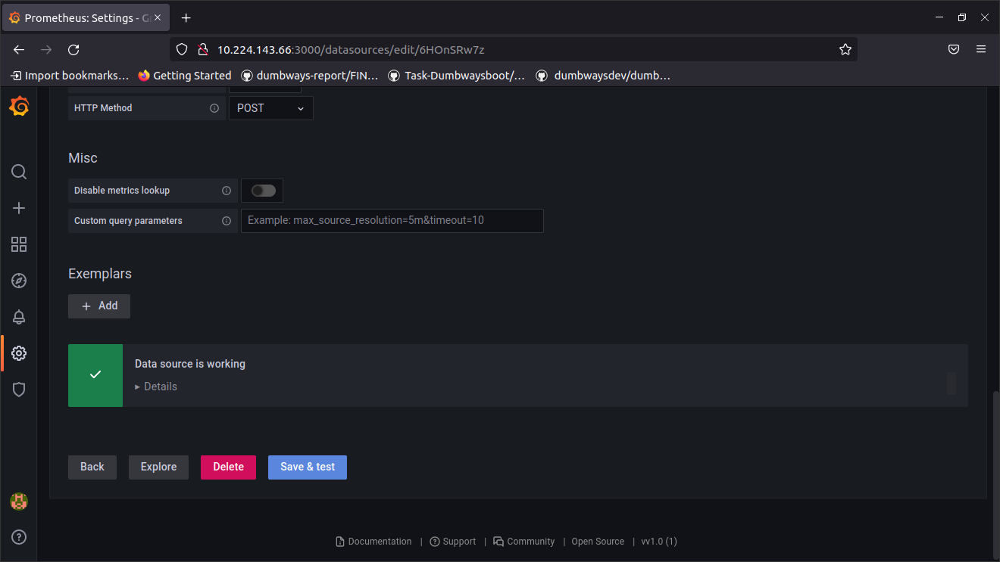
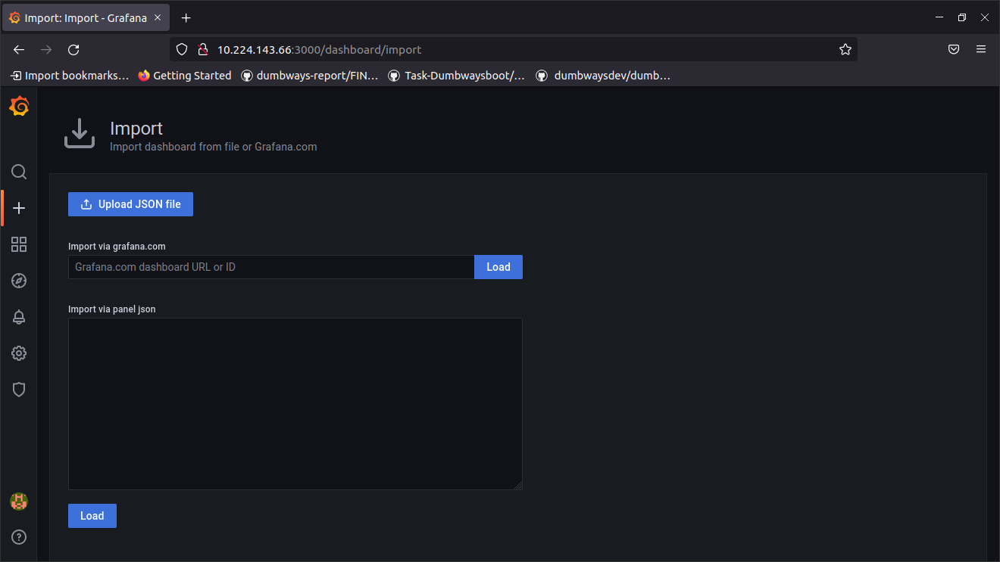
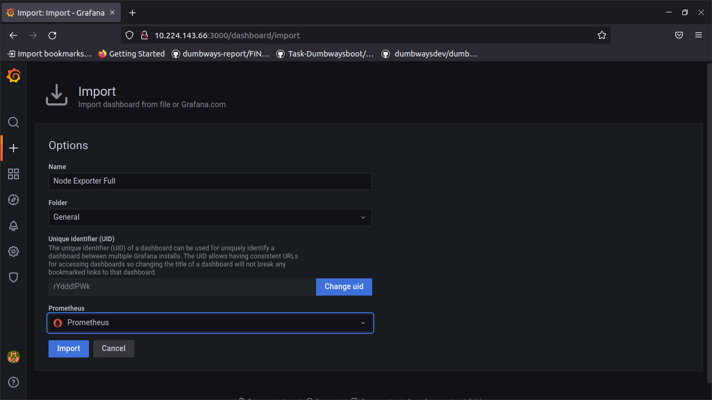
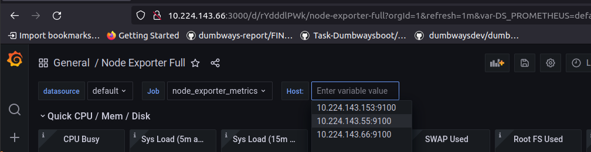
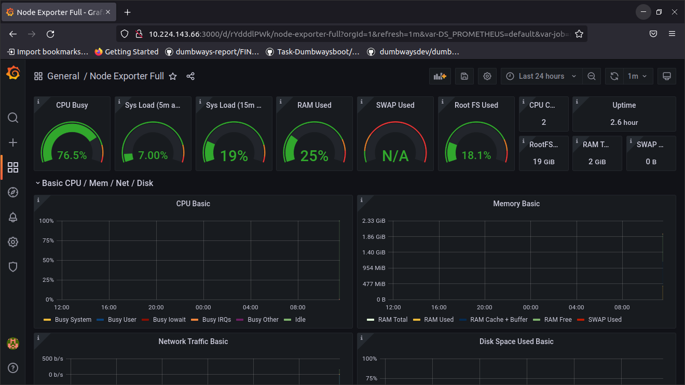

## Installasi Node Exporter pada semua server

- Buat file docker-compose-node_exporter.yml

```
version: '3'

services:
  node_exporter:
    image: prom/node-exporter:latest
    container_name: node_exporter
    ports:
      - 9100:9100
    command:
      - '--path.procfs=/host/proc'
      - '--path.rootfs=/rootfs'
      - '--path.sysfs=/host/sys'
      - '--collector.filesystem.mount-points-exclude=^/(sys|proc|dev|host|etc)($$|/)'
    restart: unless-stopped
    volumes:
      - /proc:/host/proc:ro
      - /sys:/host/sys:ro
      - /:/rootfs:ro
```

- Deploy node exporter dengan docker compose menggunakan ansible playbook

setup-node_exporter.yml
```
- hosts: all
  become: true
  tasks:
    - name: copying docker compose file
      copy:
        src: docker-compose-node_exporter.yml
        dest: /home/irvan/docker-files/

    - name: run docker compose
      shell: docker-compose -f docker-files/docker-compose-node_exporter.yml up -d
```

- Akses node exporter menggunakan web browser dengan url ip-addres:9100

<p align="center"></p>

## Installasi Prometheus dan Grafana pada salah satu server

- Buat file prometheus.yml untuk konfigurasi dari prometheus agar membaca node_exporter server lain

```
global:
  scrape_interval: 1m

scrape_configs:
  - job_name: "prometheus-metrics"
    scrape_interval: 1m
    static_configs:
      - targets: ['10.224.143.66:9090']
  - job_name: "node_exporter_metrics"
    scrape_interval: 1m
    static_configs:
      - targets: ['10.224.143.66:9100','10.224.143.55:9100','10.224.143.153:9100']
```

- Buat file docker-compose-monitoring.yml untuk install prometheus dan grafana

```
version: '3'
services:
 prometheus:
   image: prom/prometheus:latest
   container_name: prometheus
   restart: unless-stopped   
   volumes:
     - /home/irvan/prometheus/prometheus.yml:/etc/prometheus/prometheus.yml
     - /home/irvan/prometheus/web.yml:/etc/prometheus/web.yml
   command:
     - '--config.file=/etc/prometheus/prometheus.yml'
     - '--storage.tsdb.path=/prometheus'
     - '--web.console.libraries=/etc/prometheus/console_libraries'   
     - '--web.console.templates=/etc/prometheus/consoles'
     - '--web.enable-lifecycle'
   ports:
     - 9090:9090

 grafana:
   image: grafana/grafana:latest-ubuntu
   container_name: grafana
   volumes:
     - /home/irvan/grafana/data:/var/lib/grafana
   ports:
     - 3000:3000
   user: "1000"
   restart: unless-stopped
```

- Deploy prometheus dan grafana dengan docker compose menggunakan ansible playbook

setup-monitoring.yml
```
- hosts: monnginx
  become: true
  tasks:
    - name: Copying docker compose monitoring file
      copy:
        src: docker-compose-monitoring.yml
        dest: /home/irvan/docker-files/

    - name: Copying prometheus.yml file
      copy:
        src: prometheus.yml
        dest: /home/irvan/prometheus/
    
    - name: Run compose up 
      shell:
        cmd: docker-compose -f docker-files/docker-compose-monitoring.yml up -d

    - name: Change grafana folder permission
      shell: "sudo chown 1000:1000 grafana/data/"
      args:
        executable: /bin/bash
```

<p align="center"></p>
<p align="center"></p>

## Monitoring menggunakan template file .json

- Buat data source terlebih dahulu
- Masukkan url prometheus

<p align="center"></p>

- pilih save & test

<p align="center"></p>

- Import file template .json 

<p align="center"></p>

- Pilih data source yang sudah dibuat tadi, lalu klik import

<p align="center"></p>

- Pada Gambar terlihat kita dapat memonitoring ke-3 server yang ada pada file prometheus.yml

<p align="center"></p>

- Server sudah dapat dimonitoring mulai dari CPU, RAM, Storage, Network, dll

<p align="center"></p>
